# Ambient CHORUS

> One complaint is easy to ignore. Chorus finds the pattern.

Ambient CHORUS is a privacy-first community investigator built for the AWS Agents for Humans
Hackathon (Good Neighbor Agents track). It watches a channel a community already uses, notices when
separate messages describe the same unresolved problem, asks each affected person privately what
may be shared, and turns only the facts they authorized into one evidence-backed request to the
party that can fix it. Then it follows up on the answer.

## Why it exists

Complaint systems fail for a structural reason: every report arrives alone. A resident emails the
property manager about the elevator, and nobody sees that other households reported the same fault
days apart, because those reports sit in separate inboxes and conversations. The pattern that would
make the case undeniable is spread across people who are, rightly, wary of handing private details
to a system they do not control.

CHORUS draws a hard line between **finding the pattern** and **deciding what may leave the
community**, and puts deterministic code, not a language model, on the disclosure side of that
line.

## How it works

```mermaid
flowchart LR
    Feed["Community messages<br/>(untrusted)"] --> Monitor["Monitor agent<br/>finds candidate patterns"]
    Monitor --> Mandates["Residents decide, fact by fact,<br/>what may be shared"]
    Mandates --> Investigator["Investigator agent<br/>tests independence and contradictions"]
    Investigator --> Compiler["Privacy compiler<br/>(deterministic, no LLM)"]
    Compiler -->|"ShareableCaseView only"| Action["Action agent<br/>drafts a cited request"]
    Action --> Approval["Human approves<br/>the exact email"]
    Approval --> Sender["Sender<br/>(one SES attempt)"]
    Sender --> Manager["Property manager"]
    Manager -->|"reply with a deadline"| Watcher["Commitment watcher<br/>(EventBridge Scheduler)"]
    Watcher --> Verify["Affected resident<br/>verifies the outcome"]
```



1. **Detect.** The Monitor agent reads the ambient feed and proposes facts and a possible recurring
   issue. It cannot grant disclosure.
2. **Ask.** Each resident sees only the facts drawn from their own messages and approves, adjusts,
   refuses, or later revokes each one. Sharing *what happened* and sharing *who said it* are
   separate permissions.
3. **Investigate.** The Investigator agent checks whether the reports really describe the same
   problem, separates independent evidence from duplicates, and surfaces contradictions. Two
   independent sources corroborate a case; aggregate disclosure needs three distinct contributors.
   These are different tests, enforced by different code.
4. **Compile.** A deterministic privacy compiler checks every fact against its current mandate,
   purpose, and destination, and either denies with reason codes or writes an immutable
   `ShareableCaseView`. It is the only code that can create one.
5. **Act.** The Action agent receives that view and nothing else (no database, no private storage,
   no tools) and proposes structured claims that must each cite exported facts. A deterministic
   renderer builds the email, and a human approves the exact preview.
6. **Send once.** A dedicated sender makes one deliberate SES attempt for that approval. An
   ambiguous outcome is recorded as `SEND_UNKNOWN` and never retried automatically.
7. **Follow through.** A manager's reply can create a commitment only from an explicit, cited date.
   EventBridge Scheduler fires a watcher when it falls due, and only the affected resident can mark
   it fulfilled or missed. `ACTIONED` never means `RESOLVED`.

This is **compile, don't filter**. CHORUS never hands a model private data and hopes a redaction
prompt holds: the agent that talks to the outside world never receives what it must not disclose.

## Agents and deterministic safety systems

| Component | Kind | What it may do |
|---|---|---|
| Monitor / Intake | LLM agent | extract facts and suggest candidate cases from messages |
| Investigator / Skeptic | LLM agent | assess sameness, independence, contradictions, and evidence status |
| Action Coordinator | LLM agent | draft cited claims from a `ShareableCaseView`, and nothing else |
| Mandate / privacy compiler | deterministic Lambda | the sole creator of `ShareableCaseView`; fails closed |
| Proposal validator and renderer | deterministic code | reject uncited or ungrounded claims; render the exact email a human approves |
| Sender | deterministic Lambda | the only component that calls SES |
| Commitment watcher | deterministic Lambda | replay-safe deadline checks; never resolves a case |

Agents never call each other and never persist their own output; application code owns ordering,
validation, and every state transition. Each agent runs in its own AgentCore runtime with its own
IAM role, so these boundaries are enforced by IAM as well as by code. The release-blocking
invariants are listed in [AGENTS.md](AGENTS.md) and
[01-principles-and-invariants.md](docs/architecture/01-principles-and-invariants.md).

## The demo scenario

V1 is deliberately narrow: one community, one synthetic feed, one elevator problem. The frozen
corpus in [`demo/fixtures/elevator-v1`](demo/fixtures/elevator-v1/) holds 24 messages: six elevator
incidents from four residents, thirteen unrelated messages about parcels, parking, plumbing, and
other building life, one resident's private health and unit details, a contradicting management
statement, a photo, and a prompt-injection attempt. Several incidents never name the elevator, so a
keyword rule cannot find the pattern.

The story ends with a manager's promise, a missed deadline, and a case that goes back to *ready for
action* instead of being marked resolved.

## Project status

The application, the three-surface web app, the local demo, and the infrastructure code for all
eleven AWS CDK stacks are implemented. Live AWS status, as last recorded on 2026-09-13:

| Area | State |
|---|---|
| Foundation, Network, Data, Reset, Compiler, Sender, and Watcher stacks | **Live**: deployed and independently verified in `us-east-1` |
| SES sending identity and configuration set | **Live**: verified; a direct `SendEmail` canary was delivered to a real Gmail inbox |
| Application, Inbound, and Observability stacks | Built; **not yet re-verified live** |
| Monitor, Investigator, and Action agents on Bedrock AgentCore | **Blocked**: code-complete and validated by offline CDK synthesis, but the account's AgentCore Runtime quota is 0 |
| Amazon Nova 2 Lite invocation | **Blocked**: `ValidationException: Operation not allowed`; an AWS Support case is open and escalated |

The live agent pipeline has therefore not yet run end to end on AWS. The local quickstart below
runs the complete flow with deterministic stand-in agents. Prerequisites and remaining work are in
[deployment-contract.md § 21](docs/plans/deployment-contract.md#21-status).

## Run it locally (no AWS)

The local composition ([`src/chorus/composition/local.py`](src/chorus/composition/local.py)) runs
the same application and privacy-compiler code as the deployed stack, wired to local adapters
instead of AWS. It needs **no AWS account, no credentials, no Docker, and no `.env`**, and it never
calls the deployed stack.

What is simulated: the Monitor, Investigator, and Action agents are deterministic, fixture-driven
fakes in [`src/chorus/infrastructure/local/`](src/chorus/infrastructure/local/)
(`LexicalFakeMonitorAgent`, `CautiousFakeInvestigatorAgent`, `CautiousFakeActionAgent`,
`LiteralSpanCommitmentExtractor`), not live models. Storage is in memory, the sender writes to a
local outbox file instead of calling SES, and the scheduler and clock are in-process stand-ins.

Prerequisites: Python 3.12, [`uv`](https://docs.astral.sh/uv/), Node.js (CI uses 22), and npm.

```text
uv sync --frozen
npm ci
uv run chorus-api serve --port 8080            # terminal A: leave running
npm run dev --workspace @ambient-chorus/web    # terminal B: leave running
```

Open the URL Vite prints (default `http://127.0.0.1:5173`) and click through in order:

1. **Reset demo** seeds the frozen `elevator/v1` corpus (24 messages, 4 residents).
2. **Detect pattern** runs the Monitor stand-in; open the case it surfaces.
3. **Propose mandates**, then use the persona selector to step through each resident and decide
   their own mandate (Resident B deliberately narrows one fact to `INTERNAL_ONLY`).
4. **Run investigation**: the Investigator stand-in flags the contradiction. The private panel
   still legitimately shows the sentinel private fact.
5. **Compile shareable view**: the privacy compiler excludes the private facts, and the shareable
   panel does not contain them.
6. **Propose action**, switch persona to `case_approver`, **Approve**, then **Execute / send**. This
   writes to the local outbox, not SES.
7. **Deliver reply** (a fixture manager reply) and a commitment appears `PENDING`; **Advance clock
   past due date** moves it to `DUE`; switch to the affected resident and mark **Missed**.
8. The case returns to **Ready for action**, not **Resolved**. `ACTIONED != RESOLVED` is the point
   of the demo.

The same sequence runs automatically in [`apps/web/tests/hero.spec.ts`](apps/web/tests/hero.spec.ts)
(browser) and [`tests/smoke/test_local_hero_flow.py`](tests/smoke/test_local_hero_flow.py)
(backend only).

## Architecture on AWS

Everything is defined with AWS CDK v2 in Python ([`infra/cdk`](infra/cdk/)) as eleven stacks in
`us-east-1`:

| Stack | What it holds |
|---|---|
| `AmbientChorusFoundation` | no resources; a toolchain-compatibility stack |
| `AmbientChorusNetwork` | a VPC with two isolated subnets, no NAT or internet gateway, and VPC endpoints |
| `AmbientChorusData` | the Core, Shareable, and Audit DynamoDB tables; private and export evidence buckets with separate KMS keys; the agent artifact bucket |
| `AmbientChorusAgents` | the Monitor, Investigator, and Action AgentCore runtimes, each with its own role, inference profile, and log group |
| `AmbientChorusCompiler` | the privacy compiler Lambda |
| `AmbientChorusSender` | the sender Lambda and the SES configuration set |
| `AmbientChorusWatcher` | the commitment watcher Lambda, the schedule group, and its dead-letter queue and alarm |
| `AmbientChorusApplication` | the HTTP API, the FastAPI Lambda, and the operation worker Lambda |
| `AmbientChorusInbound` | the SES receipt rule, SNS topic, and inbound-mail Lambda for manager replies |
| `AmbientChorusReset` | an operator-only Lambda that resets the `DEMO` namespace and nothing else |
| `AmbientChorusObservability` | Lambda error alarms and a dashboard |

Private and shareable data live in separate tables and buckets, and IAM enforces the trust zones:
the Action runtime cannot read the database or private evidence, the compiler cannot call Bedrock
or SES, and the sender cannot read Core data. The component diagram and trust zones are in
[00-system-overview.md](docs/architecture/00-system-overview.md) and
[02-trust-iam-deployment-configuration.md](docs/architecture/02-trust-iam-deployment-configuration.md);
identity, networking, canaries, cost, and rollout order are in
[deployment-contract.md](docs/plans/deployment-contract.md).

## Tech stack

| Layer | Choice |
|---|---|
| Agents | Strands Agents on Amazon Bedrock AgentCore Runtime; Amazon Nova 2 Lite (`amazon.nova-2-lite-v1:0`, temperature 0) |
| Backend | Python 3.12, FastAPI, Pydantic v2, AWS Lambda (Mangum), API Gateway HTTP API |
| Data | DynamoDB (three tables), S3 (private and export evidence), KMS |
| Messaging and time | Amazon SES v2, EventBridge Scheduler, SQS dead-letter queue |
| Frontend | React, strict TypeScript, Vite, TanStack Query, CSS Modules |
| Infrastructure | AWS CDK v2 (Python), CloudWatch |
| Tooling | `uv`, Ruff, mypy, pytest, Hypothesis, import-linter; npm, ESLint, Vitest, Playwright |

## Repository layout

```text
apps/api/         FastAPI application and routes
apps/web/         React + Vite web app with the three UI surfaces
src/chorus/       domain, privacy compiler, application services, ports, adapters, composition
runtimes/         the three AgentCore agent runtimes
functions/        Lambda entry points: api, worker, compiler, sender, commitment watcher, inbound mail, demo reset
infra/cdk/        AWS CDK app and stacks
demo/fixtures/    the frozen elevator corpus
tests/            unit, property, contract, smoke, repair, and live-evaluation suites
tools/            artifact build and publish, documentation, license, and secret checks
docs/             architecture, ADRs, deployment, and demo documentation
```

The annotated tree is in
[13-repository-and-coding-standards.md](docs/architecture/13-repository-and-coding-standards.md).

## Development

Install once, then run the same checks as CI:

```text
uv sync --frozen
npm ci

uv run ruff format --check .
uv run ruff check .
uv run mypy src tests infra tools apps/api runtimes
uv run lint-imports
uv run pytest
uv run python tools/check_architecture_links.py
uv run python tools/check_license.py
uv run python tools/check_secrets.py
npm run lint
npm run typecheck
npm test
npm run build
npm run e2e:list
npm run cdk:synth:offline
```

- The persistence contract tests use DynamoDB Local when it is running
  (`docker compose up dynamodb-local`) and skip otherwise; CI sets
  `CHORUS_REQUIRE_DYNAMODB_LOCAL=1` so they cannot skip.
- `npm run cdk:synth:offline` synthesizes every stack with placeholder identities and no AWS
  access. `npm run cdk:synth` is deployment-capable and fails closed without real deployment inputs.
- Live model evaluations in `tests/evaluation` skip unless a live agent binding is configured.
- The pure compiler uses the `rfc8785` package for RFC 8785/JCS canonical JSON rather than
  approximating it with `json.dumps`. `uv.lock` and `package-lock.json` are the authoritative
  resolved versions and license inputs.

## Documentation

| Start here | For |
|---|---|
| [docs/README.md](docs/README.md) | the documentation index: precedence, frozen decisions, reading order, ADR index |
| [System overview](docs/architecture/00-system-overview.md) | scope, actors, components, and the primary flow |
| [Privacy compiler](docs/architecture/05-privacy-compiler-and-shareable-view.md) | the evaluation order and the `ShareableCaseView` schema |
| [Security threat model](docs/architecture/10-security-threat-model.md) | threats, controls, and accepted residual risks |
| [Architecture decision records](docs/adr/) | why each hard call was made |
| [AWS deployment contract](docs/plans/deployment-contract.md) | how the system is deployed and verified, and what is live |
| [Demo runbook](docs/plans/demo-plan.md) | the five-minute live demo and its failure handling |
| [AGENTS.md](AGENTS.md) | mandatory rules for coding agents working in this repository |

## Scope

CHORUS is a credible, least-privilege hackathon build, not a production resident-communications
platform. V1 has one community, one synthetic input adapter, one scenario, one external destination
type, one human approver role, and exactly three UI surfaces: the Ambient Signal Feed, the Private
Mandate Thread, and Case + Action. Production identity, multi-tenancy, Slack or WhatsApp
integrations, general OCR, vector search, and workflow engines are out of scope; see the
[cut list](docs/plans/cut-list.md).

## License

[MIT](LICENSE)
