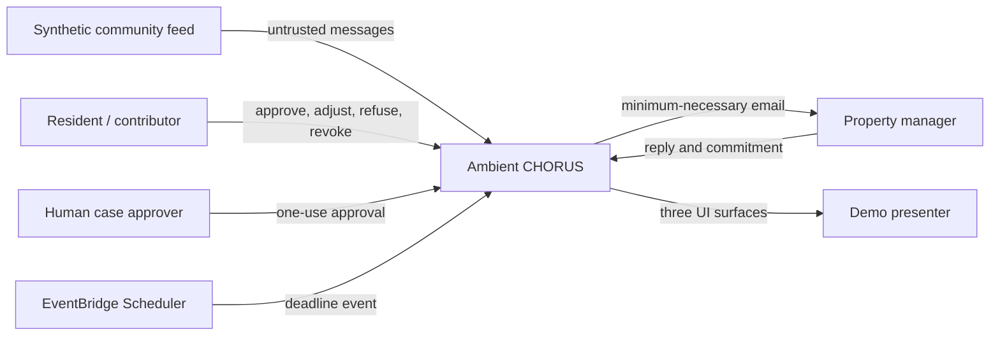
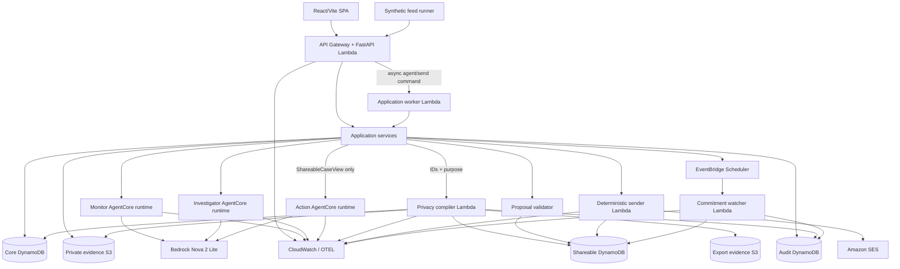
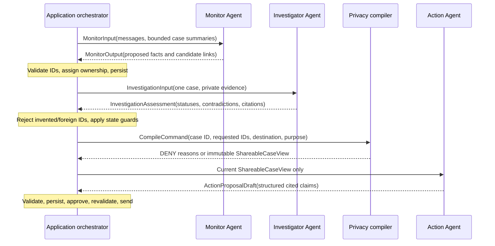

# System overview

## Outcome, scope, and constraints

Ambient CHORUS turns dispersed, private community reports into a minimum-necessary, authorized external action. V1 supports one demo community, one synthetic feed, elevator failures, four contributors, a property-manager destination, and one human approver. Expected demo scale is fewer than 100 messages, 20 open cases, 20 contributors, and one external action per case. Design targets 10 messages/second bursts, p95 non-agent API latency under 500 ms, agent operations under 30 seconds, and recovery rather than high availability. Privacy correctness and duplicate-send prevention outrank latency.

V1 is not a tenant platform, emergency service, legal case manager, autonomous sender, or general community surveillance system. It must never imply that agent output is verified merely because it is well-formed.

## System context

External inputs, including manager replies, are untrusted data. Only authenticated application commands, deterministic policy, state-machine guards, and explicit human approvals have authority.

## Component architecture

The diagram is logical: API and worker share application code and an equivalent application role but deploy as separate Lambda entry points so long-running agent/send work outlives HTTP. Compiler, sender, watcher, and each agent are separately deployable security principals.

## Primary flow

1. The synthetic adapter POSTs stable message IDs. Ingestion conditionally stores each message and ignores exact replays.
2. The application invokes the Monitor with explicit messages and bounded case summaries. A strict contract validator accepts fact/report/candidate proposals; deterministic code assigns cases and persists.
3. Contributors receive per-fact proposed mandates and approve, adjust, refuse, or later revoke immutable mandate versions.
4. The application invokes the Investigator with case-scoped private facts and evidence. Deterministic code rejects foreign or nonexistent IDs before applying evidence classifications.
5. When evidence sufficiency is at least two independent sources, the case may become `READY_FOR_ACTION`; this says nothing about disclosure permission.
6. The compiler reloads current state strongly consistently and either denies with structured reasons or writes an immutable `ShareableCaseView`.
7. The application passes exactly that view to the Action Agent. The agent returns a structured proposal with claims citing exported fact IDs.
8. Deterministic validation, rendering, one-use human approval, freshness revalidation, and sender state transitions precede SES.
9. A manager reply may create a cited commitment. EventBridge Scheduler invokes an idempotent watcher. Only resident verification can move the case to `RESOLVED`.

## Agent flow

Agents never call one another. They do not persist their own outputs. Application code owns ordering, retry budgets, validation, and state transitions.

## Frozen stack

| Concern | Choice |
|---|---|
| Backend | Python 3.12, FastAPI, Pydantic v2, Mangum on Lambda |
| Agent SDK/model | Strands Agents, Bedrock application inference profiles backed by `amazon.nova-2-lite-v1:0`, temperature `0` |
| Agent hosting | Three separate Bedrock AgentCore Runtime direct-code Python resources/endpoints; IAM inbound auth, MMDSv2, isolated VPC subnets, no NAT/internet |
| Deterministic jobs | Python 3.12 Lambda |
| Data | Three on-demand DynamoDB tables; point-in-time recovery outside disposable demo stacks |
| Evidence | Separate versioned, encrypted private and export S3 buckets |
| Send | SES v2 through dedicated sender; sandbox-safe verified recipient for demo |
| Deadlines | EventBridge Scheduler one-time schedules to Lambda; SQS DLQ only for exhausted scheduler deliveries |
| API/static hosting | API Gateway HTTP API; S3 + CloudFront SPA |
| Observability | JSON logs, embedded metric format, OpenTelemetry/Strands traces to CloudWatch/X-Ray with content capture off |
| Infrastructure | AWS CDK v2 in Python |
| Python tooling | `uv`, Ruff, mypy, pytest, Hypothesis where valuable |
| Web tooling | React, strict TypeScript, Vite, TanStack Query, native `fetch`, CSS Modules, npm, Vitest, Playwright smoke |

Agent model ARNs are separate configuration per agent but all three must resolve to Nova 2 Lite in V1. A model substitution requires evaluation evidence and an ADR, not an environment-only change.

## Availability and consistency posture

- Commands use conditional writes, idempotency records, and strongly consistent reads when authorization or execution depends on freshness.
- UI queries may be eventually consistent unless a response is immediately following a command; command responses return the committed representation.
- No cache may sit between the compiler/sender and current authorization state.
- Agent timeouts are retryable before persistence, at most once automatically with the same invocation ID. External sends have separate, stricter semantics.
- DynamoDB and S3 are durable systems of record; AgentCore session state is disposable and AgentCore Memory is not used.
