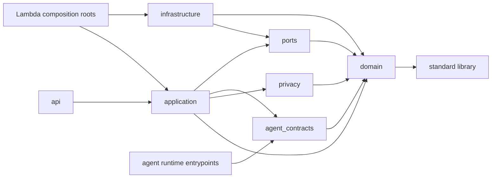

# Principles, invariants, and dependency policy

## Design principles

1. **Compile, do not filter.** Disclosure is constructed from authorized structured facts; private prose is never post-redacted into an external message.
2. **Fail closed.** Missing, ambiguous, stale, malformed, cross-case, or unsupported authorization data produces `DENY` or a typed error.
3. **LLMs propose; deterministic code decides and acts.** Agent outputs are untrusted typed suggestions until semantic validation.
4. **Least data and least privilege.** Payloads and IAM policies contain only what the next component needs.
5. **Authorization is immutable evidence.** Every mandate decision, compile, approval, and execution is versioned and auditable.
6. **Separate truth dimensions.** Evidence status, disclosure scope, identity permission, and case state do not imply one another.
7. **One side effect, one owner.** The compiler alone writes views; the sender alone calls SES; the watcher alone consumes due events.
8. **Replay is normal.** Inputs, schedules, web clicks, and Lambda invocations may repeat. Every command has a deterministic idempotency rule.
9. **Small bounded contexts.** Domain, privacy, agents, application, and infrastructure have explicit contracts without a general workflow engine.
10. **Demo reliability is designed.** Fixed data and a controllable demo clock are allowed; precomputed agent, compile, approval, send, or watcher outcomes are not.

## Testable security invariants

| ID | Invariant | Primary enforcement | Required proof |
|---|---|---|---|
| SEC-01 | `INTERNAL_ONLY` never appears in a safe view. | Compiler scope gate and output schema | Exhaustive compiler unit table + property test |
| SEC-02 | Action cannot retrieve private or case data. | Separate package, runtime role, resource policies | Import-contract and IAM simulation tests |
| SEC-03 | Action cannot read either S3 bucket or any DynamoDB table. | No IAM actions; no tools | CDK assertion and deployed deny probe |
| SEC-04 | Action cannot call SES or invoke compiler/sender. | No IAM actions/resource policies | CDK assertion and deployed deny probe |
| SEC-05 | Only compiler creates views. | Share table resource policy/IAM | Principal matrix and CloudTrail audit |
| SEC-06 | Only sender calls SES. | SES identity policy/IAM | Principal matrix and CloudTrail audit |
| SEC-07 | A cross-case requested or cited ID denies the whole operation. | Compiler/proposal validators | Adversarial tests |
| SEC-08 | Revoked/expired/refused/unapproved mandates cannot authorize. | Ordered mandate gates | Boundary-time tests with injected clock |
| SEC-09 | Anonymous content never exports identity. | Separate identity grant and transformation | Pairwise permission matrix tests |
| SEC-10 | Aggregation requires 3 distinct contributors. | Compiler contributor set | Duplicate-contributor/root tests |
| SEC-11 | Corroboration requires 2 independent sources. | Investigation sufficiency function | Independence graph tests |
| SEC-12 | Safe view stales on relevant case, mandate, or policy change. | Snapshot hashes and strong reads | T1/T2/T3 concurrency tests |
| SEC-13 | Action claims cite only facts in the current view. | Proposal validator | Hallucinated/foreign ID tests |
| SEC-14 | Approval binds one proposal/view/hash tuple. | Immutable approval record | Mutation and concurrent approval tests |
| SEC-15 | Execution cannot duplicate a message. | Idempotency key + conditional transition | concurrent/double-click tests |
| SEC-16 | `SEND_UNKNOWN` never auto-retries. | State machine and retry classifier | timeout-after-send test |
| SEC-17 | Evidence text has no authority. | Treat text only as delimited data; no policy tools | injection corpus tests |
| SEC-18 | `ACTIONED` never implies `RESOLVED`. | State guards | complete transition matrix test |
| SEC-19 | Private URI or sensitive field cannot serialize in safe types. | Separate Pydantic models with `extra='forbid'` | serialization negative tests |
| SEC-20 | Logs omit private content. | allowlisted event schema/redaction processor | log-capture tests |
| SEC-21 | A model-proposed evidence status may lower a fact's status and may never raise it. | evidence-status ladder and deterministic recomputation ([ADR-015](../adr/ADR-015-evidence-status-and-verification.md)) | ladder and overclaim-downgrade tests |

There is no privacy-threshold exception in V1. The phrase “unless an explicit policy exception exists” is reserved for a future accepted policy version and ADR; `policy/v1` has none.

## Deterministic semantics

- All instants are timezone-aware UTC and serialize as RFC 3339 with exactly six fractional digits and `Z`.
- Entity IDs are UUIDv4 in normal operation and namespace-scoped UUIDv5 in fixed demo fixtures. IDs serialize as lowercase hyphenated strings.
- One explicit exception exists, accepted in [ADR-011](../adr/ADR-011-monitor-deterministic-identities.md): **Monitor-derived replay identities** — a Monitor-derived `Report`, a candidate `CommunityCase`, an `EvidenceRoot`, a Monitor fact slot, and the Monitor apply progress and audit rows that replay must re-address — are namespace- and community-scoped UUIDv5 derived from canonical authoritative input. Every other entity, including `ActionProposal`, `Approval`, `ActionExecution`, `Commitment`, `InvestigationAssessment`, `ApplicationOperation`, and every ordinary `AuditEvent`, stays UUIDv4. No agent-authored text — a summary, title, confidence, reason, client reference, or model-chosen typed value — may enter a replay identity. No hash or identity algorithm changes without a superseding ADR.
- Persisted versions are positive monotonically increasing integers. Mutation is a conditional `version = expected_version` update producing `version + 1`; immutable artifacts never update.
- Sets serialize as sorted arrays; maps have string keys; floating-point values are forbidden in authorization artifacts.
- Canonical JSON uses RFC 8785 JSON Canonicalization Scheme and UTF-8. Hashes are `sha256:` plus 64 lowercase hex characters.
- A command idempotency key is scoped to `{namespace, command_type, actor_id}` and binds a SHA-256 request hash. Reuse with a different request returns `IDEMPOTENCY_CONFLICT`.
- The injected `Clock` is read once per command. No domain or compiler function calls the system clock directly.

## Dependency direction

Forbidden imports include domain→Pydantic/AWS/FastAPI/Strands, privacy→LLM/AWS/API, application→boto3/FastAPI, Action runtime→private contracts/repositories, and web→backend Python. CI uses import-linter rules plus a static scan of the Action deployment artifact.

## Authority hierarchy

In descending order, authority is: authenticated human command; accepted immutable mandate/approval; deterministic policy and state guard; persisted domain state; validated agent proposal; untrusted message/evidence/external reply text. Text inside lower levels cannot impersonate a higher level.

## Change control

Authorization-sensitive fields, enum semantics, policy order, state transitions, canonicalization, hash inputs, IAM access, agent payloads, and side-effect ownership are architecture. Change the relevant ADR and documentation before code. Additive UI copy, CSS, and test fixtures are not architecture unless they change what data crosses a boundary.
