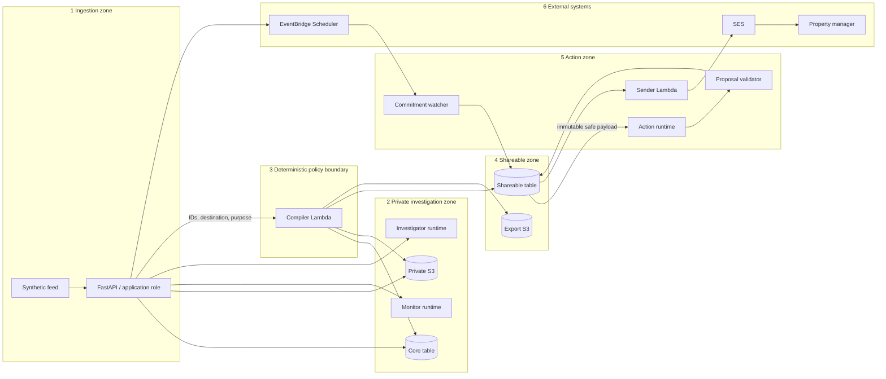

# Trust zones, IAM, deployment, and configuration

## Trust-zone diagram



Trust is directional. Data moving right is re-modeled into narrower types, not passed as a generic document. No route moves data from a later zone back into a private authorization decision without validation as untrusted evidence.

## IAM notation and resources

`R` = read/list/get, `W` = write/update, `I` = invoke the named runtime/function, `S` = external send, `—` = no allow, and `D` = explicit deny in the role boundary or resource policy. Explicit denies are used for the Action runtime and sender defense-in-depth; lack of an allow remains the default elsewhere.

| Principal | Core table | Share table | Audit table | Private S3 | Export S3 | Monitor runtime | Investigator runtime | Action runtime | Compiler | Sender | Scheduler | SES |
|---|---:|---:|---:|---:|---:|---:|---:|---:|---:|---:|---:|---:|
| FastAPI/application | RW | RW* | W | RW | R | I | I | I | I | I | W | D |
| Monitor runtime | D | D | — | D | D | — | — | — | D | D | D | D |
| Investigator runtime | D | D | — | D | D | — | — | — | D | D | D | D |
| Compiler Lambda | R(all)/W(fence only) | R(all safe)/W(view only) | W | R | W | — | — | — | — | D | D | D |
| Action runtime | D | D | — | D | D | — | — | — | D | D | D | D |
| Sender Lambda | D | R(view/proposal/approval)/W(execution only) | W | D | D | — | — | — | I(fence API only) | — | D | S |
| Commitment watcher | D | R/W(commitment/case projection) | W | D | D | — | — | — | D | D | D | D |
| Scheduler execution role | D | D | D | D | D | — | — | — | D | D | — | D; invokes watcher only |

`*` The application may create proposals, approvals, commitments, and read views. Shareable-table partition keys begin with distinct `NS#...#VIEW#`, `VIEW_CURRENT#`, `ACTION#`, `ACTION_CURRENT#`, and `CASE#` prefixes. IAM `dynamodb:LeadingKeys` allows compiler writes only to the two view prefixes and application writes only to action/case prefixes; the application therefore cannot create or mutate a view. Conditions/repository invariants further protect immutable entity types, and CloudTrail tests the principal identity.

Supporting-resource permissions are explicit as well:

| Principal | Bedrock inference profile | Own logs/traces | Demo access secret | Destination address secret | Private/export evidence KMS keys | Async Lambda invoke |
|---|---|---|---|---|---|---|
| FastAPI | DENY | WRITE | READ token hash | DENY | encrypt/decrypt private; decrypt export through evidence adapter | INVOKE worker/compiler only |
| Application worker | DENY | WRITE | DENY | DENY | same scoped evidence operations as application use case | INVOKE three agents/compiler/sender only |
| Monitor runtime | INVOKE Monitor profile only | WRITE own group | DENY | DENY | DENY | DENY |
| Investigator runtime | INVOKE Investigator profile only | WRITE own group | DENY | DENY | DENY | DENY |
| Compiler Lambda | DENY | WRITE own group | DENY | DENY | decrypt private; encrypt export | DENY |
| Action runtime | INVOKE Action profile only | WRITE own group | DENY | DENY | DENY | DENY |
| Sender Lambda | DENY | WRITE own group | DENY | READ exact destination secret | DENY | INVOKE compiler fence operation only |
| Commitment watcher | DENY | WRITE own group | DENY | DENY | DENY | DENY |
| Scheduler execution role | DENY | service delivery metrics only | DENY | DENY | decrypt DLQ key only | INVOKE watcher only |

KMS key policies repeat these principal/resource constraints; possessing an S3/DynamoDB action without the required key action is insufficient. Safe destination label/version/routing token are deployment configuration, not Secrets Manager reads by agents/compiler.

All three agent runtime roles have only:

- `bedrock:InvokeModel`/`InvokeModelWithResponseStream` on that agent's application inference profile;
- CloudWatch log and OTLP/X-Ray emission to its own log group;
- ECR/S3 artifact bootstrap permissions required by AgentCore, scoped to its artifact;
- KMS decrypt only if required for the artifact/log key.

They have no general network tool and no persistent AgentCore filesystem or Memory. All use Python 3.12 direct-code artifacts and AgentCore VPC network mode in two isolated subnets with no internet gateway/NAT route. The runtime security group permits TCP 443 only to the Bedrock Runtime and required telemetry endpoint security groups; a scoped S3 gateway endpoint permits only AgentCore service artifact access. Runtime inbound policies allow invocation only from the application role. MMDSv2 is required, processes run non-root, and session IDs are random per invocation because V1 is stateless.

## Principal-specific constraints

- **Application:** its broad private access is why it never receives an SES permission. It invokes the sender with an action ID, never a rendered body or recipient address.
- **Compiler:** accepts IDs and intent, then performs its own strongly consistent reads. It has no Bedrock permission, so policy cannot become probabilistic. Its only Core write is the short-lived send-authorization fence.
- **Action runtime:** has no tools registered in Strands. Network configuration permits only the Bedrock model path required by AgentCore; IAM remains the authoritative boundary.
- **Sender:** resolves the recipient from an allowlisted destination registry in configuration. It cannot read Core, so even compromised rendering cannot fetch private details. It can invoke only the compiler's typed acquire/release fence operation and receives no private result.
- **Watcher:** accepts only `CommitmentDueEvent`, does not invoke an LLM, and cannot send external messages.
- **Audit readers:** a separate operational role may query audit records but is not part of the application runtime. Raw values are not stored in normal audit fields.

## AWS resource layout

One account and one primary Region per environment. Default demo Region is `us-east-1`; all resources are tagged `Project=ambient-chorus`, `Environment`, `Namespace`, and `DataClass`.

| Stack | Resources |
|---|---|
| `ChorusNetworkStack` | VPC, two isolated subnets, no NAT, AgentCore runtime security groups, Bedrock Runtime/CloudWatch Logs/X-Ray interface endpoints, scoped S3 gateway endpoint |
| `ChorusDataStack` | three DynamoDB tables, two S3 buckets, KMS aliases where customer-managed encryption is enabled, lifecycle policies |
| `ChorusAgentStack` | three AgentCore runtimes/endpoints, application inference profiles, distinct runtime roles/log groups |
| `ChorusComputeStack` | API Gateway HTTP API, FastAPI Lambda, application worker Lambda, compiler Lambda, sender Lambda, watcher Lambda, scheduler group/role, scheduler DLQ, SES configuration set |
| `ChorusWebStack` | private SPA bucket, CloudFront distribution, response/security headers |
| `ChorusObservabilityStack` | dashboards, alarms, log retention, X-Ray/OTEL wiring |

CDK v2 Python libraries are pinned through the `infra` uv dependency group; the matching CDK CLI is a pinned root npm dev dependency. AgentCore uses the stable `aws_cdk.aws_bedrockagentcore.Runtime`/CloudFormation resources, not the deprecated alpha module, with direct-code S3 artifacts and `networkMode=VPC`. CDK outputs endpoint ARNs and resource names; runtime application configuration receives them through Lambda environment variables.

## Environment behavior

| Environment | Storage/agents | External effects | Data lifecycle |
|---|---|---|---|
| `test` | in-memory repositories, fake clock/agents/storage/sender/scheduler | none | per test |
| `development` | DynamoDB Local; filesystem evidence/outbox; manual scheduler; fake agents by default, optional Bedrock | email to file only | developer-controlled `.local/` |
| `demo` | deployed AWS resources; live AgentCore/Bedrock/compiler/SES/scheduler | SES restricted to allowlisted verified destination | reset deletes only `DEMO` namespace |
| `production` | reserved; startup rejects it in V1 | blocked until identity/privacy review | no V1 retention behavior; a production ADR is required |

No implementation may treat `demo` as production-ready. A hard configuration validator rejects `ENVIRONMENT=production` in V1.

## Configuration contract

Configuration is loaded once into a strict Pydantic Settings model. Unknown `CHORUS_` variables fail startup; secrets never have defaults. AWS credentials use the default provider chain and are not environment fields in the app model.

```dotenv
# non-secret identity
CHORUS_ENVIRONMENT=development             # test|development|demo; production rejected in V1
CHORUS_NAMESPACE=LOCAL_alice                # test/development; deployed demo is exactly DEMO
CHORUS_AWS_REGION=us-east-1
CHORUS_LOG_LEVEL=INFO
CHORUS_POLICY_VERSION=policy/v1
CHORUS_PUBLIC_BASE_URL=http://localhost:5173

# persistence and storage
CHORUS_CORE_TABLE=chorus-core-development
CHORUS_SHAREABLE_TABLE=chorus-shareable-development
CHORUS_AUDIT_TABLE=chorus-audit-development
CHORUS_PRIVATE_EVIDENCE_BUCKET=chorus-private-evidence-development
CHORUS_EXPORT_EVIDENCE_BUCKET=chorus-export-evidence-development
CHORUS_DYNAMODB_ENDPOINT=http://localhost:8000  # development only; absent on AWS
CHORUS_LOCAL_DATA_DIR=.local

# agent endpoints and model resources
CHORUS_AGENT_MODE=fake                     # fake|agentcore; demo requires agentcore
CHORUS_MONITOR_RUNTIME_ARN=                 # required when mode=agentcore
CHORUS_INVESTIGATOR_RUNTIME_ARN=
CHORUS_ACTION_RUNTIME_ARN=
CHORUS_MONITOR_MODEL_PROFILE_ARN=
CHORUS_INVESTIGATOR_MODEL_PROFILE_ARN=
CHORUS_ACTION_MODEL_PROFILE_ARN=
CHORUS_AGENT_TIMEOUT_SECONDS=30

# action and scheduling
CHORUS_SENDER_FUNCTION_ARN=
CHORUS_COMPILER_FUNCTION_ARN=
CHORUS_WATCHER_FUNCTION_ARN=
CHORUS_WORKER_FUNCTION_ARN=
CHORUS_SCHEDULER_GROUP=chorus-development
CHORUS_SCHEDULER_ROLE_ARN=
CHORUS_SES_CONFIGURATION_SET=chorus-development
CHORUS_DESTINATION_ID=property_manager:demo
CHORUS_DESTINATION_DISPLAY_LABEL=Property Management
CHORUS_DESTINATION_REGISTRY_VERSION=1
CHORUS_DESTINATION_ROUTING_TOKEN=00000000-0000-0000-0000-000000000000 # safe random UUID placeholder
CHORUS_DESTINATION_REGISTRY_SECRET_ARN=     # sender-only: same version/token plus verified address
CHORUS_DEMO_ACCESS_SECRET_ARN=              # deployed demo access token hash
CHORUS_DEMO_CLOCK_ENABLED=true              # rejected outside development/demo

# observability: no prompt/content capture
CHORUS_OTEL_ENABLED=false
OTEL_EXPORTER_OTLP_ENDPOINT=
OTEL_SERVICE_NAME=chorus-api
```

The checked-in `.env.example` created in Phase 0 contains names and safe placeholders only. Local secrets go in ignored `.env`; deployed secrets go in Secrets Manager. `CHORUS_AGENT_MODE=fake`, local scheduler, file outbox, demo clock, `/demo/*`, and reset commands are rejected unless the environment allows them.

## Demo access model

Cognito is intentionally omitted. The deployed hackathon demo is a single-presenter environment protected by a high-entropy access token entered at runtime and stored only in browser `sessionStorage`; the API compares its hash to Secrets Manager. `X-Chorus-Demo-Actor` selects one of fixed demo personas only after token validation. This is not production authentication, is limited to the `DEMO` namespace, and is a recorded residual risk. API Gateway throttling, narrow CORS, and a reset-specific second confirmation string limit abuse.

## Deployment and rollback

1. CI validates Python/web/tests/import rules and `npm exec cdk -- --app "uv run python -m infra.cdk.app" synth`.
2. CDK deploys data, agents, compute, web, then observability. Runtime versions and endpoints are immutable; the application references an endpoint alias/version.
3. A post-deploy smoke test invokes each agent with non-sensitive fixture data, compiles an allow and a deny case, and uses an SES mailbox simulator or verified demo address.
4. Rollback changes the AgentCore endpoint/application alias and Lambda versions. Data schema changes must be backward-compatible within a release; destructive migrations are forbidden in V1.

CloudFormation deletion protection is enabled for non-disposable data stacks. Demo stack deletion retains buckets/tables by default; `uv run chorus-demo reset --namespace DEMO --confirm DEMO` is the only routine data cleanup path.
