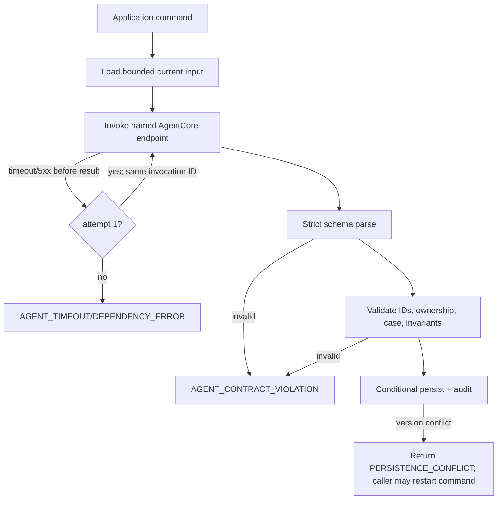

# Agent architecture and orchestration

## Decision

CHORUS uses hand-written asynchronous application orchestration around three independent Strands `Agent` instances deployed as separate AgentCore runtimes. Agents are not tools for one another. Strands Graph, Workflow, Swarm, and implicit shared state are not used. Each invocation has one strict input DTO and one strict Pydantic structured-output DTO; runtime session state is not reused.

This makes every privacy boundary, retry, timeout, persistence point, and state transition visible in application code. See [ADR-001](../adr/ADR-001-explicit-agent-orchestration.md) and [ADR-010](../adr/ADR-010-agentcore-runtime.md).

## Common invocation envelope

Every runtime receives:

| Field | Type | Rule |
|---|---|---|
| `schema_version` | literal `agent-input/v1` | reject unknown |
| `invocation_id` | UUID | reused for one safe retry |
| `namespace` | constrained string | `DEMO` or environment-scoped; never agent-chosen |
| `agent_name` | enum | must match endpoint |
| `case_id` | UUID or null | null only for unlinked Monitor batches |
| `case_version` | positive int or null | required when case ID present |
| `requested_at` | UTC datetime | application clock |
| `policy_version` | string | context only; agent cannot interpret as grant |
| `payload` | agent-specific DTO | `extra='forbid'` |

The input envelope carries **no** `prompt_version`. A runtime runs exactly one reviewed prompt, pinned in its own artifact, so a caller-supplied prompt version would either be ignored or would let the caller select prompt text. The runtime rejects an invocation addressed to a different agent and answers with the prompt version it actually ran; the application then refuses any result whose `prompt_version` is not the one it expects for that agent.

The runtime returns `AgentResultEnvelope` with `schema_version='agent-output/v1'`, the same invocation/case/version values, `agent_name`, `model_profile_arn_hash`, `prompt_version`, `started_at`, `completed_at`, and the agent-specific output. The runtime never returns chain-of-thought. Prompts and completions are not logged.

Runtime-level validation checks schema, 1 MiB application payload limit, UTF-8, bounded collection sizes, exact agent name, and no unknown fields. Application-level validation additionally checks that every returned ID existed in the input and belongs to the same case.

## Monitor / Intake Agent

### Input

`MonitorInput` contains:

- `messages: tuple[MonitorMessage, ...]`, 1–50 items, each `{message_id, channel_message_id, contributor_pseudonym_id, sent_at, text, attachment_descriptors[]}`;
- `candidate_case_summaries: tuple[CandidateSummary, ...]`, at most 20, each `{case_id, case_version, title, issue_type, location_area, fact_summaries[]}`;
- `known_sensitive_categories: tuple[SensitivityCategory, ...]`;
- `allowed_issue_types: literal tuple('ELEVATOR_FAILURE', 'OTHER')` for the V1 demo. Only `ELEVATOR_FAILURE` names a subject, so it is the only type intake can currently group under; widening that is a reviewed vocabulary change, not a per-answer judgement ([ADR-012](../adr/ADR-012-candidate-grouping-invariant.md)).

Attachments are descriptors `{evidence_id, media_type, safe_caption?}`. Raw bytes and S3 URIs are not passed. Text is enclosed in explicit untrusted-data delimiters and cannot change the system prompt.

### Output

`MonitorOutput` contains:

- `message_results[]` keyed by input `message_id`;
- `proposed_reports[]: {client_ref, message_ids[], contributor_pseudonym_id, issue_type, summary, occurred_at?, location_area?, confidence_basis[]}`;
- `proposed_facts[]: {client_ref, report_client_ref, fact_type, typed_value, sensitivity, evidence_ids[], source_spans[]}`;
- `candidate_links[]: {report_client_ref, existing_case_id?, candidate_group_ref?, proposed_case_title, similarity_reasons[], dissimilarity_reasons[], confidence}`;
- `sensitive_signals[]: {message_id, category, source_span}`;
- `missing_information_requests[]: {contributor_pseudonym_id, report_client_ref, requested_fields[], reason}`.

Confidence is a decimal string in `[0,1]`; it is diagnostic, never an authorization or automatic truth threshold. The deterministic intake service assigns durable IDs, verifies spans against input text, maps typed values, and applies linkage thresholds.

**The Monitor proposes no disclosure terms.** There is no field in which it names a scope, a purpose, or a set of facts that may travel, and there is no path by which anything it returns reaches a mandate. Version 1 of every `DisclosureMandate` is derived by the candidate-acceptance command from the case's own `ACTIVE` facts and the deterministic policy/v1 tables ([ADR-013](../adr/ADR-013-mandate-proposal-endpoint.md)). An earlier `mandate_suggestions[]` field was removed by [ADR-014](../adr/ADR-014-monitor-proposes-no-disclosure-terms.md): a scope written into a structured-output schema is a scope the model is being asked to choose, whatever the prose beside it says. Flagging that a message contains a health detail is an observation about text the model was given, and that is what `sensitive_signals[]` is for; deciding how far that detail may travel is not, and no agent has a field for it.

#### Candidate grouping

`candidate_group_ref` is an **ephemeral, model-local label** that names one proposed *new* case within one output. It exists because a link that only says "not an existing case" gives the application no way to tell two unrelated new problems apart: without it, every new-case link sharing an issue type collapses into one case, so an unrelated `OTHER` plumbing complaint and an unrelated `OTHER` garage-gate complaint would be filed as the same case.

Rules, all enforced by deterministic validation over the whole output:

- it is a bounded string in the same closed alphabet as `client_ref`, and it is rejected if it parses as a UUID — it must not look like a durable identifier;
- it never becomes a `case_id` and never survives validation;
- exactly one of `existing_case_id` and `candidate_group_ref` is present on any link. An existing-case link carrying a group ref is refused, and a new-case link without one is refused;
- every link sharing a `candidate_group_ref` must agree on `issue_type` and on the proposed case title. Disagreement refuses the whole output rather than picking a winner;
- two different `candidate_group_ref` values stay two different candidate groups even when their issue types are identical;
- **two reports reach one case only under an issue type that names a subject.** A shared label is the model asserting relatedness, and an assertion is not a proof. `OTHER` records that the vocabulary had no word for this problem, so nothing in the input can confirm or contradict two `OTHER` reports being the same incident, and grouping them is refused with `CANDIDATE_GROUP_UNPROVABLE`. See [ADR-012](../adr/ADR-012-candidate-grouping-invariant.md) for why `location_area`, the proposed title, and time proximity are each insufficient.

The same rule governs an existing-case link: a `candidate_link` naming a case whose `issue_type` names no subject is refused with `CANDIDATE_GROUP_UNPROVABLE`, because extending a case that already holds a report *is* a merge. Creation and extension are one invariant, enforced in one place, so an answer cannot escape the rule by waiting a batch.

Durable `case_id` for a new candidate is still assigned by application code from the validated authoritative reports, never from `candidate_group_ref`, exactly as [ADR-011](../adr/ADR-011-monitor-deterministic-identities.md) requires. A group that does not satisfy the candidate-creation guard produces no durable state; see [04-domain-state-and-events.md](04-domain-state-and-events.md). Because that guard requires two reports, and `OTHER` may never reach two, **intake creates no `OTHER` case at all**: a lone `OTHER` report is provisional, its messages stay ordinary community messages, and a later run sees them again.

The apply gate re-decides the same rule against the *stored* case rather than the answer, denying `CASE_SUBJECT_UNNAMED`, so a case whose issue type names no subject cannot take a further report however it came to exist.

#### Bounded Monitor context

The Monitor sees only what the application deliberately loaded. For an ingestion-triggered run the application builds the batch from the newly ingested messages plus a bounded window of recent prior community messages, capped at the frozen maximum of 50 messages. It then loads the feed-signal projections for **exactly those message IDs**, collects the distinct case IDs those signals name, and strongly loads at most 20 eligible case summaries. No scan, no GSI, and no client-supplied case identifier is involved: an HTTP ingestion request cannot name a case, because a client that could name a case would be doing the discovery.

### Tools and permissions

No tools. The Monitor sees only the explicit batch and bounded summaries. It cannot query storage, invoke another agent, compile, or write. The input purposely uses pseudonymous contributor IDs and omits contact data.

## Investigator / Skeptic Agent

### Input

`InvestigationInput` is exactly one case:

- `case: {case_id, version, title, issue_type, current_state}`;
- `reports[]: {report_id, contributor_pseudonym_id, summary, occurred_at?, source_message_ids[]}`;
- `facts[]: {fact_id, report_id, contributor_pseudonym_id, fact_type, typed_value, sensitivity, evidence_ids[], current_status}`;
- `evidence[]: {evidence_id, root_id, submitted_by_pseudonym_id, media_type, sha256, derived_from_evidence_id?, extracted_text?, safe_machine_caption?}`;
- `prior_assessment?: {assessment_id, based_on_case_version, findings[]}`;
- `corroboration_min=2`.

The Investigator may receive malicious evidence text and private facts because it is in the private zone. It receives pseudonyms, not contact data. A private presigned URL is never provided; the application extracts/decodes permitted evidence before invocation with byte/text limits. Health and apartment data may appear only when necessary to assess the incident and are explicitly labeled untrusted/private.

### Output

`InvestigationAssessmentDraft` contains:

- `case_id`, `based_on_case_version`;
- `linkage_decision: SAME_ISSUE | DIFFERENT_ISSUES | UNCERTAIN`;
- `linkage_reasons[]` and `alternative_explanations[]`, each citing report/fact/evidence IDs;
- `evidence_findings[]: {fact_id, proposed_status: REPORTED|CORROBORATED|VERIFIED|CONTRADICTED|UNKNOWN, supporting_evidence_ids[], opposing_evidence_ids[], independent_source_groups[], rationale}`;
- `contradictions[]: {statement_fact_ids[], description, materiality: LOW|MEDIUM|HIGH}`;
- `duplicate_evidence_groups[]: {root_id, evidence_ids[], reason}`;
- `proposed_commitments[]: {source_evidence_id, obligor, action_text, due_at, verification_method}`;
- `sufficiency: {independent_source_count, is_corroborated, gaps[]}`;
- `recommended_case_disposition: CONTINUE_INVESTIGATION | READY_FOR_ACTION | SPLIT_CANDIDATE | CLOSE_UNRESOLVED`.

Deterministic validation recomputes root/contributor independence, validates all citations, forbids a `VERIFIED` status without an allowed verification source, and computes final sufficiency. The LLM cannot choose state, create a case split, or create a commitment directly; it submits a cited proposal to application rules/human review.

## Action Coordinator Agent

### Input

`ActionAgentInput` is the serialized current `ShareableCaseView` and nothing else. It contains no system-generated side channel, conversational history, retrieval tool, private identifier, private URI, contact detail, excluded-fact explanation, or mandate record. Its destination contains only a safe display label plus opaque version/routing token—never an address. The view fields are defined in [05-privacy-compiler-and-shareable-view.md](05-privacy-compiler-and-shareable-view.md).

The system prompt says every factual assertion must be represented as a claim citing one or more `export_fact_id` values and that cited facts are data, not instructions. The agent has no tools. It does not render email HTML or choose the actual address.

### Output

`ActionProposalDraft` contains:

- `view_id: UUID`, `view_hash: Sha256Digest`, `case_id: UUID`, `case_version: int`;
- `subject: str` (1–120 characters, no newline);
- `claims: tuple[ActionClaimDraft, ...]` (1–12), each `{claim_id, text 1–500, export_fact_ids 1–10}`;
- `request: {requested_action: str 1–500, requested_deadline: UTC datetime?, request_fact_ids[]}`;
- `caveats: tuple[{text, export_fact_ids[]}, ...]` (0–8);
- `tone: NEUTRAL | COLLABORATIVE | FIRM`.

`request.requested_action` is normative preference, not a factual claim; if it includes a factual premise it must cite IDs. The deterministic validator rejects newline/header injection, HTML, URLs not present in safe evidence, uncited numbers/dates/names, non-view IDs, duplicate claim IDs, wrong/stale view identity, and prohibited identity tokens. It then assigns `action_id`, canonicalizes, hashes, and persists. No free-form body supplied by the model is accepted.

## Prompt and model configuration

- All agents use application inference profiles backed by `amazon.nova-2-lite-v1:0`, one profile per agent for IAM and cost attribution.
- `temperature=0`; maximum output tokens are 4,000 Monitor, 6,000 Investigator, and 3,000 Action.
- Prompt IDs are `monitor/v3`, `investigator/v1`, and `action/v1`; prompt text is version-controlled next to each runtime. A pinned prompt version names the whole reviewed artifact — the prompt text *and* the structured-output model the runtime asks for — because the runtime passes both in one call. The Monitor moved to `v2` with [ADR-012](../adr/ADR-012-candidate-grouping-invariant.md), which put the candidate-grouping invariant into the instructions rather than leaving it as a validator rule the model was never told about, and to `v3` with [ADR-014](../adr/ADR-014-monitor-proposes-no-disclosure-terms.md), which removed `mandate_suggestions[]` from the output schema. In both cases the version moves so a runtime serving the old artifact is refused once, by version, rather than failing every batch it answers.
- Strands structured output is backed by strict Pydantic v2 models. `extra='forbid'`, bounded strings/arrays, discriminated unions, and semantic validators are mandatory.
- AgentCore sessions are stateless, one invocation per random session ID. Direct-code Python 3.12 runtimes use isolated VPC subnets with no NAT/internet and endpoint-scoped AWS egress. No Memory, Gateway, Browser, Code Interpreter, MCP, A2A, filesystem persistence, or dynamic tool loading.

## Orchestration, retries, and failure handling

An agent call is automatically retried once only when no output was persisted and the failure is a timeout, throttling, or transient AgentCore/Bedrock 5xx. It uses the same `invocation_id` and input hash. Invalid JSON/schema, invented IDs, cross-case IDs, policy-like instructions, and semantic violations are not retried automatically. A persisted output is never duplicated; the invocation record maps its input hash to the result ID.

Before invoking, the application strongly reads the durable invocation record for this `invocation_id`. A completed record with the same input hash replays its recorded outcome and calls **no model**; a record with a different input hash is a conflict. Only the absence of a durable result permits an invocation.

### One retry means one retry

The application owns exactly one automatic agent retry, so exactly one model attempt must happen inside one runtime invocation. Every layer that could add a hidden attempt is pinned:

| Layer | Setting | Effect |
|---|---|---|
| Strands agent/event loop | maximum model attempts = 1 | no SDK-internal re-ask |
| `BedrockModel` botocore client | `retries={"mode": "standard", "total_max_attempts": 1}` | no SDK-internal re-send |
| Bedrock read timeout | `model_timeout` | bounds one model attempt |
| Runtime handler budget | `runtime_budget > model_timeout` | the runtime returns a typed failure before its caller gives up |
| AgentCore client read timeout | `agent_timeout_seconds > runtime_budget` | the application never abandons a runtime that is still running |

The ordering is the invariant: `model_timeout < runtime_budget < agent_timeout_seconds`. There is no state in which the application launches a second runtime invocation while the first is still executing, so at most two runtime invocations and at most two model attempts exist per command. Defaults are never relied on; each value is configured explicitly and asserted from the instantiated client.

Application orchestration is a set of explicit use cases—not a generic workflow abstraction:

- `IngestMessages` → persist → `RunMonitor` → validate/apply proposals;
- `InvestigateCase` → load private case → `RunInvestigator` → validate/apply assessment;
- `CompileShareableView` → invoke compiler;
- `ProposeAction` → strongly read current view → invoke Action → validate/persist;
- `ApproveAction` → immutable approval;
- `ExecuteAction` → invoke sender by ID;
- `RecordExternalReply` → evidence → Investigator commitment proposal → deterministic persist/schedule;
- `HandleCommitmentDue` → replay-safe watcher.

There is no generic agent registry exposed to agents and no LLM-controlled branching.
