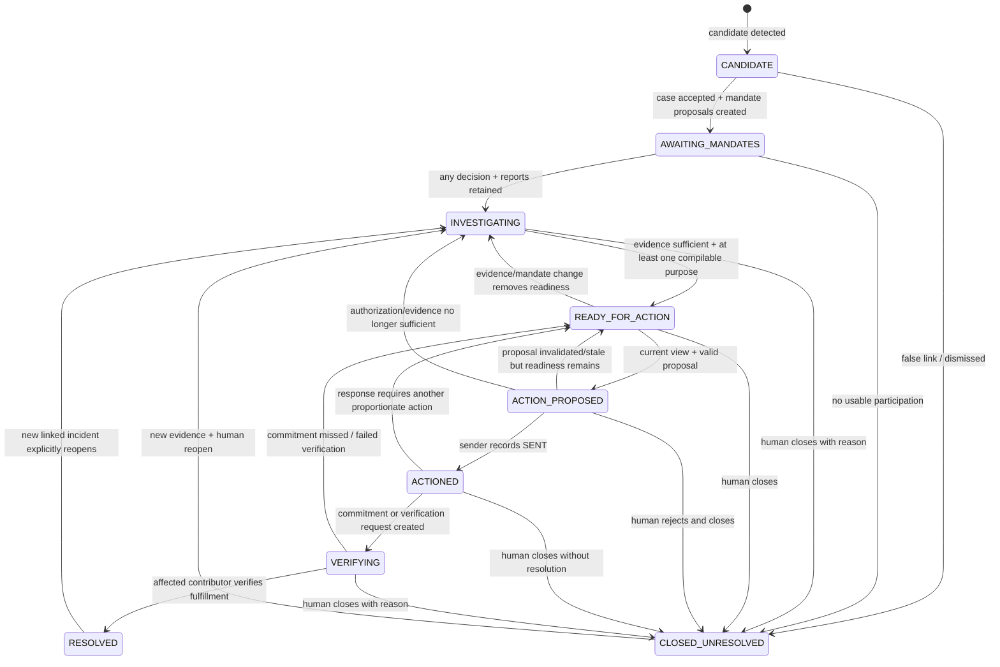

# Domain model, case state machine, and events

## Modeling conventions

Domain entities are immutable `@dataclass(frozen=True, slots=True)` values returned by repositories; updates construct a new version and use optimistic concurrency. Boundary and persistence DTOs are strict Pydantic v2 models. Every persisted item also has `namespace`, `entity_type`, `created_at`, and `schema_version`. Mutable aggregates have `version`, `updated_at`, and no in-place mutation. IDs are nominal UUID wrapper types in domain code so `FactId` cannot be passed as `CaseId`.

Enums serialize by exact uppercase string value. UTC/hash/list rules follow [01-principles-and-invariants.md](01-principles-and-invariants.md). Nullable fields are explicit and omitted nowhere in canonical authorization artifacts. Sensitive values render as `***` in `repr` and are never placed in exception text.

## Core enums

- `DisclosureScope`: `INTERNAL_ONLY`, `AGGREGATE_ONLY`, `ANONYMOUS_CASE`, `NAMED_CASE`, `EXTERNAL_ACTION` (ordered only by explicit policy table, never enum ordinal).
- `EvidenceStatus`: `REPORTED`, `CORROBORATED`, `VERIFIED`, `CONTRADICTED`, `UNKNOWN`.
- `CaseState`: `CANDIDATE`, `AWAITING_MANDATES`, `INVESTIGATING`, `READY_FOR_ACTION`, `ACTION_PROPOSED`, `ACTIONED`, `VERIFYING`, `RESOLVED`, `CLOSED_UNRESOLVED`.
- `MandateStatus`: `PROPOSED`, `APPROVED`, `REFUSED`, `REVOKED`, `EXPIRED`, `SUPERSEDED`.
- `ActionExecutionState`: `DRAFT`, `APPROVED`, `SENDING`, `SENT`, `FAILED`, `SEND_UNKNOWN`.
- `CommitmentStatus`: `PENDING`, `DUE`, `FULFILLED`, `MISSED`, `CANCELLED`.
- `SensitivityCategory`: `GENERAL`, `IDENTITY`, `CONTACT`, `UNIT_LOCATION`, `HEALTH`, `MINOR`, `PRIVATE_QUOTE`, `PRIVATE_EVIDENCE_URI`.
- `FactType`: `INCIDENT_OCCURRENCE`, `SERVICE_IMPACT`, `LOCATION_AREA`, `IDENTITY_ATTRIBUTE`, `UNIT_LOCATION`, `HEALTH_DETAIL`, `MANAGEMENT_STATEMENT`, `CONTRADICTION`, `COMMITMENT_TERM`, `EVIDENCE_DESCRIPTION`.
- `Purpose`: V1 literal `REQUEST_ELEVATOR_REPAIR_AND_RESPONSE`; new purpose requires policy/ADR update.
- `DestinationKind`: V1 literal `PROPERTY_MANAGER`.

## Typed fact values

`Fact.value` is a closed discriminated union; arbitrary JSON metadata is forbidden.

| Discriminator | Fields | Invariants / sensitivity default |
|---|---|---|
| `INCIDENT_OCCURRENCE` | `occurred_at: datetime`, `equipment: literal ELEVATOR`, `failure_mode: STUCK\|OUT_OF_SERVICE\|ERRATIC\|UNKNOWN` | event time UTC; `GENERAL` |
| `SERVICE_IMPACT` | `impact_code: DELAY\|TRAPPED\|ACCESS_BLOCKED\|OTHER`, `summary: str<=500` | summary may be private; `GENERAL` unless person detail |
| `LOCATION_AREA` | `area: LOBBY\|ELEVATOR_CAB\|COMMON_AREA\|BUILDING` | never apartment/unit; `GENERAL` |
| `IDENTITY_ATTRIBUTE` | `display_name: str<=120` | `IDENTITY`; requires separate identity grant |
| `UNIT_LOCATION` | `unit_label: str<=40` | `UNIT_LOCATION`; policy/v1 always internal |
| `HEALTH_DETAIL` | `subject_relation: SELF\|FAMILY\|OTHER`, `detail: str<=500` | `HEALTH`; policy/v1 always internal |
| `MANAGEMENT_STATEMENT` | `statement: str<=1000`, `speaker_org: str<=120`, `stated_at: datetime` | private until mandated/cited |
| `CONTRADICTION` | `statement_fact_ids: tuple[FactId,2..10]`, `summary: str<=500` | all IDs same case |
| `COMMITMENT_TERM` | `obligor: str<=120`, `action_text: str<=500`, `due_at: datetime`, `verification_method: str<=300` | cites external reply evidence |
| `EVIDENCE_DESCRIPTION` | `description: str<=500`, `media_kind: IMAGE\|EMAIL\|TEXT` | never contains URI |

## Entity contracts

### Community

Purpose: tenant-like boundary for the one V1 building without implementing general multi-tenancy.

Fields: `community_id: CommunityId`, `namespace: Namespace`, `name: str[1..120]`, `timezone: IANAZone`, `status: ACTIVE|ARCHIVED`, `version: int`, timestamps. `namespace + community_id` is immutable; name/status are mutable by conditional update. Owned by application administration. Name is private operational data; only a safe building label may be separately exported.

### Contributor

Purpose: a person who owns reports, facts, and mandate decisions.

Fields: `contributor_id`, `community_id`, `pseudonym: str[1..40]`, `display_name: SensitiveStr?`, `email: SensitiveStr?`, `status: ACTIVE|WITHDRAWN`, `version`, timestamps. IDs/community are immutable; contact/display name are mutable. Owned by the contributor/application. Pseudonym may enter private agent payloads; identity/contact never enter `ShareableCaseView` unless a separately authorized name is compiled as a fact. Email never enters a view.

### CommunityMessage

Purpose: idempotently preserve ambient source input and lineage.

Fields: `message_id`, `community_id`, `adapter: SYNTHETIC`, `channel_message_id: str[1..160]`, `contributor_id?`, `sent_at`, `received_at`, `raw_text: SensitiveStr[1..10000]`, `attachment_ids: tuple[EvidenceItemId,...]`, `content_sha256`, `ingestion_idempotency_key`, `processing_status: NEW|PROCESSED|REJECTED`, `version`, timestamps. Unique adapter/channel ID per community. Raw text/content hash are immutable; processing status alone changes. Owned by ingestion. Entire content is private and never copied to shareable storage/logs.

### Report

Purpose: a contributor-scoped assertion extracted from one or more messages.

Fields: `report_id`, `case_id?`, `community_id`, `contributor_id`, `source_message_ids: nonempty tuple`, `issue_type`, `private_summary: SensitiveStr[1..1000]`, `occurred_at?`, `location_area?`, `evidence_ids`, `status: ACTIVE|DUPLICATE|RETRACTED`, `duplicate_of_report_id?`, `version`, timestamps. Every source message has the same community and, when known, contributor. A duplicate never counts independently. Case linkage/status may change; lineage and owner do not. Private-zone only.

`case_id` remains optional in the broader domain model, because a later correction or split path may hold a report between cases. **A Phase-3 persisted `Report` row always has a non-null `case_id`**: the Core key grammar addresses a report inside its case partition, so a case-less report has no address to live at.

A Monitor report proposal that cannot satisfy the candidate-creation guard therefore stays **provisional**. It becomes no `Report`, no `Fact`, no case, and no feed signal, and V1 does not invent an unlinked-report table to hold it. It is not lost either: the source messages remain ordinary community messages, and the bounded Monitor context window described in [03-agent-architecture.md](03-agent-architecture.md) includes recent prior messages, so a later run over a corroborating message reconsiders them and may then form a candidate. Discovery is deferred, not discarded.

Phase-3 Monitor may **not** move an already-linked report from one case to another. If a message or report that a feed signal already binds to one case is proposed for a different case, the whole apply fails closed with a typed linkage conflict. Re-linking is an explicit later correction/split use case with its own authority.

### Fact

Purpose: smallest policy-addressable assertion.

Fields: `fact_id`, `case_id`, `report_id`, `community_id`, `contributor_id`, `fact_type`, `value: FactValue`, `sensitivity`, `evidence_ids`, `evidence_status`, `source_message_ids`, `supersedes_fact_id?`, `status: ACTIVE|WITHDRAWN`, `version`, timestamps. Owner and case are immutable. Corrections create a new fact and withdraw/supersede the old one; evidence status may be conditionally updated. Each cited evidence/report/message is same case/community. Private-zone only.

### EvidenceRoot

Purpose: identify one underlying evidence origin across copies/forwards so duplicates cannot manufacture corroboration.

Fields: `root_id`, `community_id`, `root_sha256`, `media_type`, `first_observed_at`, `derivation_kind: ORIGINAL|FORWARDED|TRANSFORMED`, `parent_root_id?`, `version=1`, timestamps. Roots are immutable and content-addressed within a community. `parent_root_id` chains collapse to the earliest known root for independence. Private-zone metadata; hash is not exported directly.

### EvidenceItem

Purpose: stored evidence object and its provenance.

Fields: `evidence_id`, `root_id`, `community_id`, `case_id`, `submitted_by_contributor_id`, `source_message_id?`, `private_object_key: SensitiveStr`, `media_type`, `byte_length`, `sha256`, `captured_at?`, `uploaded_at`, `derived_from_evidence_id?`, `malware_scan_status: PENDING|CLEAN|REJECTED`, `extraction_status: NOT_NEEDED|PENDING|COMPLETE|FAILED`, `extracted_text: SensitiveStr?`, `version`, timestamps. Object key/content lineage are immutable; scan/extraction results update conditionally. An item cannot cross case/community. Private-zone only.

### DisclosureMandate

Purpose: immutable contributor authorization version for exact fact content and separately for identity.

Fields: `mandate_id`, `version`, `case_id`, `community_id`, `contributor_id`, `status`, `fact_grants: tuple[FactGrant,...]`, `identity_grant: IdentityGrant`, `allowed_destination_ids: nonempty tuple[DestinationId,...]`, `allowed_purposes: nonempty tuple[Purpose,...]`, `valid_from`, `expires_at?`, `proposed_at`, `decided_at?`, `revoked_at?`, `decision_actor_id?`, `supersedes_version?`, `terms_hash`, timestamps.

`FactGrant` is `{fact_id, max_scope, allow_safe_transformation: bool}`. `IdentityGrant` is `{externally_shareable: bool, max_scope: ANONYMOUS_CASE|NAMED_CASE|EXTERNAL_ACTION}`. Every fact is owned by the contributor and same case. `INTERNAL_ONLY` is not a grant. Approval requires decision actor=contributor, `valid_from <= decision time < expires_at` when expiry exists, and canonical `terms_hash`. Adjust creates version N+1 with new terms and marks N `SUPERSEDED`; refuse/revoke create a new terminal version and current pointer. Historical versions never mutate. Entire records remain private; safe views hold opaque mandate ID/version/terms hash only.

Version 1 is always `PROPOSED` and is created by the candidate-acceptance command in [ADR-013](../adr/ADR-013-mandate-proposal-endpoint.md), never by an agent and never by the contributor. It covers every `ACTIVE` fact the contributor owns in that case, and each grant carries the deterministic `proposed_scope` for that fact's type and sensitivity — the **least-permissive useful default**, never the ceiling. The policy/v1 maximum for the same fact is a separate value that caps what any later decision may say; the proposal sits at or below it and usually well below. A general incident fact whose ceiling is `EXTERNAL_ACTION` is proposed `ANONYMOUS_CASE`; a photo description with the same ceiling is proposed `INTERNAL_ONLY`, because exporting a photograph is a choice to be made rather than a default to be accepted. A contributor may narrow a proposal or raise it toward the ceiling, and both are `ADJUST` ([ADR-014](../adr/ADR-014-monitor-proposes-no-disclosure-terms.md)).

`SUPERSEDED` is a **derived** status, not a stored one. A mandate version row is create-only, so "marks N `SUPERSEDED`" is expressed by the current pointer moving to N+1 and by N+1 recording `supersedes_version = N`. A stored version whose status is `PROPOSED` or `APPROVED` and which the current pointer no longer names reads as `SUPERSEDED` in the mandate thread. No historical row is ever rewritten.

`EXPIRED` is likewise derived from the injected clock against the current version's `valid_from`/`expires_at`; equality at `expires_at` is expired.

### Mandate decision edges

Every edge not in this table is refused with `STATE_TRANSITION_ERROR` and mutates nothing.

| Current status | `APPROVE` | `ADJUST` | `REFUSE` | `REVOKE` |
|---|---|---|---|---|
| `PROPOSED` | `APPROVED` | `APPROVED` (N+1, complete replacement terms) | `REFUSED` | refused — nothing has been granted |
| `APPROVED` | refused — already approved | `APPROVED` (N+1) | refused — use `REVOKE` | `REVOKED` |
| `REFUSED` | refused | refused | refused | refused |
| `REVOKED` | refused | refused | refused | refused |
| `EXPIRED` (derived) | refused | refused | refused | refused |

`APPROVE` carries the proposed terms unchanged; any difference is refused rather than silently accepted. `ADJUST` supplies the **complete** replacement grants, never a partial patch.

The cap on an adjustment is the deterministic policy/v1 ceiling for each fact, and never the scope the proposal happened to offer. A proposal offers the least-permissive *useful* default under that ceiling, so a contributor deliberately raising one — a photo description offered `INTERNAL_ONLY` and granted `EXTERNAL_ACTION` — is an ordinary adjustment, while the same move on a health detail or a unit label is refused because the ceiling itself is `INTERNAL_ONLY`. What an adjustment may never do is name a fact the proposal never contained.

`REFUSE` and `REVOKE` carry no grants at all: a request that includes any is refused before a version is built. `allowed_destination_ids`, `allowed_purposes`, and `valid_from` are carried forward from the proposal and are not part of the decision request; the carried-forward destination is re-derived against the current registry on every decision, so a registry that moved on stops the mandate authorizing rather than being trusted from the record.

### CommunityCase

Purpose: aggregate root for investigation and lifecycle.

Fields: `case_id`, `community_id`, `title: str[1..160]`, `issue_type`, `state`, `report_ids`, `fact_ids`, `assessment_id?`, `current_view_id?`, `current_action_id?`, `corroboration_source_count: int>=0`, `state_reason_code`, `version`, timestamps, `resolved_at?`, `closed_at?`. IDs/community are immutable. Lists are unique and same case. State changes only through the transition service. Title is private until transformed into safe summary. Owned by application/domain.

### InvestigationAssessment

Purpose: validated snapshot of skeptical reasoning, kept separate from agent draft.

Fields: `assessment_id`, `case_id`, `based_on_case_version`, `agent_invocation_id`, `linkage_decision`, `findings: tuple[EvidenceFinding,...]`, `contradictions`, `alternative_explanations`, `independent_source_count`, `is_corroborated`, `recommended_disposition`, `assessment_hash`, `created_at`, `schema_version`. Immutable. Every citation is same case and existed in invocation input. Private-zone only.

### ShareableFact

Purpose: external-safe transformed fact within a compiled view.

Fields: `export_fact_id`, `fact_type`, `safe_text: str[1..500]`, `effective_scope`, `evidence_status`, `contributor_count: int>=1`, `transformation: DIRECT|ANONYMIZED|AGGREGATED|GENERALIZED`, `transformation_rule_id`, `safe_evidence_ref_ids`, `content_hash`. Immutable and serializable to the Action zone. Source-fact lineage is stored in the private compiler audit projection, not in this model. No owner/source/contact/private location/private URI fields.

### ShareableEvidenceRef

Purpose: reference an independently created external-safe derivative.

Fields: `safe_evidence_ref_id`, `media_type`, `export_handle_id` (opaque UUID, not a URI/key), `sha256`, `caption: str<=300`, `created_by_rule_id`, `content_hash`. Immutable. Source-evidence lineage is private compiler audit data. The sender/UI resolves the handle to a time-limited URL through a shareable-zone adapter; the Action Agent never receives a private bucket key.

### ShareableCaseView

Purpose: immutable authorization artifact and sole Action input. Exact fields/hashing are normative in [05-privacy-compiler-and-shareable-view.md](05-privacy-compiler-and-shareable-view.md). It is compiler-owned, append-only, and contains only safe values.

### ActionClaim

Purpose: one factual external statement with complete citations.

Fields: `claim_id: UUID`, `text: str[1..500]`, `export_fact_ids: sorted tuple[1..10]`, `claim_hash`. Immutable within a proposal. All citations exist in the bound view; claim text passes deterministic lexical/semantic guards.

### ActionProposal

Purpose: immutable candidate action, separate from approval and execution.

Fields: `action_id`, `case_id`, `case_version`, `view_id`, `view_hash`, `subject`, `claims`, `requested_action`, `requested_deadline?`, `request_fact_ids`, `caveats`, `tone`, `agent_invocation_id`, `prompt_version`, `proposal_hash`, `status: DRAFT|INVALIDATED`, `created_at`, `schema_version`. Proposal content is immutable; invalidation is a separate status item/pointer, not a content rewrite. Safe-zone only.

### Approval

Purpose: one human authorization for exactly one immutable proposal/view tuple.

Fields: `approval_id`, `action_id`, `case_id`, `proposal_hash`, `view_hash`, `approver_id`, `decision: APPROVED|REJECTED`, `approved_at`, `expires_at`, `consumed_at?`, `approval_hash`, `idempotency_key`, `version`, timestamps. One active approval per action. `consumed_at` changes once in the same transaction that claims execution. Approver identity is operationally sensitive and not sent externally.

### ActionExecution

Purpose: durable send attempt state and ambiguity record.

Fields: `execution_id`, `action_id`, `case_id`, `approval_id`, `proposal_hash`, `view_hash`, `idempotency_key`, `state`, `attempt_number: literal 1` in V1, `rendered_message_hash`, `ses_request_token_hash`, `ses_message_id?`, `started_at?`, `finished_at?`, `failure_code?`, `failure_detail_safe?`, `reconciled_at?`, `version`, timestamps. Only sender mutates transitions after creation. Rendered body and recipient are not stored here; the exact rendered body is reconstructible from immutable proposal/view/template version and its hash.

### Commitment

Purpose: track an external promise independently of send/resolution.

Fields: `commitment_id`, `case_id`, `action_id?`, `source_evidence_id`, `obligor`, `action_text`, `due_at`, `verification_method`, `status`, `scheduler_name`, `schedule_generation: int`, `due_event_id`, `verified_by_contributor_id?`, `verification_evidence_id?`, `outcome_note?`, `version`, timestamps. Same-case cited external reply is required. Updates are guarded. `PENDING→DUE→FULFILLED|MISSED`; cancellation is human-only before fulfillment. Stored in shareable table only after action text is validated safe; the raw reply remains private.

### AuditEvent

Purpose: append-only proof of security and lifecycle decisions without private payloads.

Fields: `audit_event_id`, `namespace`, `community_id?`, `case_id?`, `actor_type: HUMAN|SYSTEM|AGENT|AWS_SERVICE`, `actor_id_hash`, `event_type`, `occurred_at`, `correlation_id`, `causation_id?`, `idempotency_key_hash?`, `entity_refs: tuple[{entity_type,id,version?}]`, `decision: ALLOW|DENY|NONE`, `reason_codes`, `safe_details: AuditDetails` closed union, `input_hash?`, `output_hash?`, `schema_version`. Immutable, append-only, and ordered by `occurred_at + audit_event_id` in storage; 90-day TTL in demo. It never contains raw values, prompt/completion bodies, private URIs, emails, apartment numbers, or health text.

An ordinary audit event uses a UUIDv4 identifier. A **replay-bound Monitor apply** audit event uses the deterministic exception accepted in [ADR-011](../adr/ADR-011-monitor-deterministic-identities.md): it is addressed by the invocation and the case it records, so a redelivered apply re-stages the identical create-only row instead of appending a second record of one decision. No other audit event may use a derived identifier.

### ApplicationOperation

Purpose: durable status for work that may outlive an HTTP request. Fields: `operation_id`, `kind: MONITOR|INVESTIGATE|PROPOSE_ACTION|SEND_ACTION|DEMO_DUE`, `namespace`, `actor_id_hash`, `case_id?`, `request_hash`, `status: PENDING|RUNNING|SUCCEEDED|FAILED`, `result_refs`, `error_code?`, `monitor_invocation_id?`, `monitor_locator_hash?`, timestamps, `version`, `expires_at_epoch`. It is mutable by guarded worker transitions, contains no raw command/agent content, and is private unless its result is safe. It is an application projection, not a case state or authorization artifact.

#### The Monitor handover identity

`monitor_invocation_id` and `monitor_locator_hash` are the durable statement of **which agent invocation this operation authorizes, and over exactly which new messages**. They exist because a worker delivery is data on a queue and a queue can be wrong, while the operation row cannot be: without them, the *first* delivery for an operation had no durable record to disagree with, so any invocation identity and any subset of the delivered locators were accepted on trust — and a caller retaining a valid `request_hash` could still change what the Monitor was given.

| Rule | Statement |
|---|---|
| Presence | required for `kind = MONITOR` before dispatch; `null` for every other kind |
| Pairing | both are set or neither is; an operation is never half-bound |
| Content | identifiers and digests only — never a locator list, never message text |
| Mutability | immutable for the operation's lifetime; every status transition copies them forward |
| Creation | written by the same transaction that creates the operation and completes its command-idempotency record, so the two can never disagree |
| API exposure | not part of the public operation status response; a poller learns status, not handover identity |

`monitor_locator_hash` is the digest of the canonical, **sorted** set of `{message_id, sent_at}` locators the run may treat as its new messages. It is sorted because the endpoint takes a batch and Monitor processing canonicalizes its order anyway, so two deliveries of the same messages in a different order are the same work. `sent_at` is inside the digest because the earliest new message anchors the recent-context window: moving one instant would change what the model reads without changing which messages it was given.

Before claiming an operation a worker must prove `job.operation_id`, `job.namespace`, `operation.kind = MONITOR`, `job.actor_id_hash`, `job.request_hash`, `job.invocation_id = operation.monitor_invocation_id`, and `hash(job.message_locators) = operation.monitor_locator_hash`. Any mismatch claims nothing, invokes nothing, mutates nothing, and leaves the operation's status and version untouched.

#### Operation transitions

| Edge | Guard | Meaning |
|---|---|---|
| `PENDING→RUNNING` | expected version; a bare conditional write, never a transaction | exactly one worker claims the operation |
| `PENDING→FAILED` | expected version | the work was refused before it started |
| `RUNNING→SUCCEEDED` | expected version | the worker finished and recorded its result refs |
| `RUNNING→FAILED` | expected version | the attempt is over, and the outcome is a verdict |
| `RUNNING→PENDING` | expected version; **MONITOR only**, and only under the four conditions below | the attempt was interrupted, and the operation is eligible to resume |

`RUNNING→PENDING` is deliberately narrow, and it exists because a Monitor operation with a persisted validated-plan snapshot is *finishable*: the model has already answered, the answer is frozen, and the only work left is bounded deterministic writes. Marking such an operation `FAILED` would abandon durable, valid, committed state and make the remainder unreachable except by a human minting a new invocation — which would mean a second pass over private text for work already paid for.

All four conditions must hold:

1. the operation's `kind` is `MONITOR`;
2. a validated-plan snapshot is already persisted for this invocation;
3. apply steps remain incomplete;
4. the failure is classified as a **resumable** apply interruption — a storage or transport failure while executing the frozen plan, with no ambiguous external side effect.

There is deliberately no new broad `RETRYABLE` status. Redelivery of a `PENDING` operation takes the ordinary `PENDING→RUNNING` claim, loads the frozen plan snapshot and the progress record, resumes at the first incomplete step, and makes **zero** model calls.

A **non-resumable** failure after partial valid progress — a stale case version, a case moved to a state intake may not extend, an integrity failure, or any deterministic conflict that means the frozen plan can no longer legally finish — is `RUNNING→FAILED` with the safe code `PARTIAL_APPLY_CONFLICT`. That code does not pretend the operation was atomic: state already committed by earlier steps remains valid and is left exactly as it is.

#### Finalization is the last step of the plan

A Monitor apply plan is *N* data steps **plus one finalization step**, and `total_steps` counts both. The finalization step commits the successful `AgentInvocationResult` in the same transaction that advances apply progress to complete, which makes one invariant hold by construction:

> `progress.is_complete` implies the durable successful invocation record already exists.

Only after that step is durable may the operation transition to `SUCCEEDED`. The ordering matters because the alternative produced the worst possible outcome: every data write committed, progress reading complete, no record saying the invocation succeeded, and the operation settled `FAILED`.

Finalization carries the same three guarantees every data step carries — its own idempotency key, its own commit proof, and *interruption rather than failure* when storage refuses — so an attempt that dies there becomes a resumable `PENDING` operation whose redelivery finishes exactly that one step, with **zero** model calls and no new domain mutation.

Once the record is durable the `SUCCEEDED` transition is independently replayable, because it writes nothing but a status:

* transition refused or its response lost → strongly reload the operation; if it is already `SUCCEEDED`, that is the answer;
* still `RUNNING` (or `PENDING`) with a durable finalized invocation → conditionally transition it to `SUCCEEDED`, whether the claim is fresh or long past the stale window.

A finalized operation is therefore **never** aged into `FAILED` by stale recovery. Stale recovery still applies exactly where it always did: to a `RUNNING` operation with no finalized invocation, where "the worker vanished" and "the worker is still going" remain indistinguishable.

## Ownership, mutation, and version summary

| Aggregate/artifact | Owner | Mutation model | Store |
|---|---|---|---|
| Community, Contributor | application admin/contributor | optimistic version | Core |
| Message, EvidenceRoot content | ingestion | immutable; status projection updates | Core/S3 |
| Report, Fact, Case | application/domain | optimistic version; corrections append | Core |
| Mandate version | contributor | immutable versions + current pointer | Core |
| Assessment | investigator validator | append-only | Core |
| View | compiler | append-only; current pointer conditional | Shareable |
| Proposal | action validator | append-only + invalidation pointer | Shareable |
| Approval | human/application | immutable decision; one-time consume | Shareable |
| Execution | sender | guarded state updates | Shareable |
| Commitment | application/watcher/human verifier | guarded version updates | Shareable |
| Audit event | emitting principal | append-only | Audit |

## Case state machine

## Transition contract

Every transition command supplies `case_id`, `expected_version`, `transition`, `actor`, `reason_code`, `correlation_id`, and idempotency key. The service checks allowed edge, edge-specific guard, and current version; one DynamoDB transaction updates the case and appends an audit event/outbox projection. An exact replay returns the original result; a different request under the key conflicts. Illegal edges are never coerced.

| Transition | Required guard | Caused by | Retry/state on failure |
|---|---|---|---|
| create `CANDIDATE` | at least 2 potentially related report proposals, not necessarily corroborated | intake service | retryable before persist; no case on failure |
| Monitor links a report into an existing case | case state is Monitor-linkable *and* the case version the agent saw is still current | intake service | case unchanged; typed stale/ineligible failure |
| `CANDIDATE→AWAITING_MANDATES` | human/demo accepts candidate; proposals exist for every participating owner, created in the same transaction ([ADR-013](../adr/ADR-013-mandate-proposal-endpoint.md)) | `POST /v1/cases/{case_id}/mandates` | remains candidate |
| `AWAITING_MANDATES→INVESTIGATING` | at least one non-proposed decision or timeout/refusal recorded | application | remains awaiting |
| `INVESTIGATING→READY_FOR_ACTION` | validated assessment; `independent_source_count>=2`; no material unresolved different-issue finding; a compile preflight finds eligible facts | application | remains investigating |
| `READY_FOR_ACTION→ACTION_PROPOSED` | current allowed view and valid proposal hashes | application | remains ready; stale view triggers recompile |
| `ACTION_PROPOSED→ACTIONED` | execution reaches `SENT`; matching approval consumed | sender/application projection | `FAILED`/`SEND_UNKNOWN` leaves case `ACTION_PROPOSED` with execution banner |
| `ACTIONED→VERIFYING` | valid commitment or explicit verification request | application | remains actioned if schedule creation fails; retry scheduling |
| `VERIFYING→RESOLVED` | affected contributor supplies explicit fulfilled decision; optional safe evidence | human verification | remains verifying |
| `VERIFYING→READY_FOR_ACTION` | affected contributor records `MISSED`/not fulfilled | human/application | same verification replay is no-op |
| any allowed → `CLOSED_UNRESOLVED` | human reason from fixed enum; no active `SENDING` execution | human | source state retained on conflict |
| terminal reopen | new report/evidence and explicit human/demo command | human/application | terminal state retained on failure |

### Monitor linkage eligibility

Attaching a new Monitor-derived report to an existing case is a mutation of that case, so it is gated by state, not merely by similarity. The Monitor-linkable states are `CANDIDATE`, `AWAITING_MANDATES`, `INVESTIGATING`, `READY_FOR_ACTION`, `ACTION_PROPOSED`, `ACTIONED`, and `VERIFYING`. In every one of those, linking appends reports and facts and leaves `state` unchanged.

`RESOLVED` and `CLOSED_UNRESOLVED` are **not** Monitor-linkable. The state machine reopens a terminal case only through an explicit human/demo reopen command, and Phase-3 Monitor has no such authority. A proposal to attach a report to a terminal case fails closed with a typed ineligible-state error; the case's `state`, `state_reason_code`, and `version` are all left exactly as they were, and no report, fact, signal, or audit row is written for that group. A terminal case is also excluded from the candidate summaries the Monitor is shown, so the ordinary path never proposes one.

Mandate revocation or policy/case changes trigger a deterministic readiness reconciliation. They do not unsend a `SENT` action. If an unsent proposal becomes stale, it is invalidated and case returns to `READY_FOR_ACTION` or `INVESTIGATING`. Case transition never relies solely on an agent recommendation.

## Internal domain events

Events are transactional outbox-style records/projections used for local dispatch and audit, not an event-sourced system and not a general event bus. Payloads contain IDs, versions, hashes, and reason codes—not raw private values.

| Event | Producer | Consumer / use |
|---|---|---|
| `MessageIngested` | ingestion | monitor orchestration / UI refresh |
| `CandidateIssueDetected` | validated monitor output | case state / UI highlight |
| `MandateRequested` | mandate service | private mandate surface |
| `MandateApproved|Adjusted|Refused|Revoked` | mandate service | stale/readiness reconciliation |
| `InvestigationUpdated` | investigator validator | case readiness/UI |
| `CaseReadyForAction` | state service | compile availability |
| `ShareableViewCompiled|CompileDenied` | compiler | action flow/audit |
| `ActionProposed` | proposal validator | approval UI |
| `ActionApproved` | approval service | execution eligibility |
| `ActionExecutionStarted|ActionSent|ActionFailed|ActionSendUnknown` | sender | case/UI/reconciliation |
| `ExternalReplyReceived` | ingestion | investigator commitment proposal |
| `CommitmentCreated` | application | scheduler adapter |
| `CommitmentDue` | EventBridge Scheduler | watcher |
| `VerificationRequested` | watcher | case UI |
| `CaseResolved|CaseUnresolved` | state/application service | UI/audit |

No event itself grants permission. Consumers reload authoritative state and use idempotency keys. Event schema versions are explicit; unknown major versions go to a typed failure/DLQ rather than best-effort parsing.
