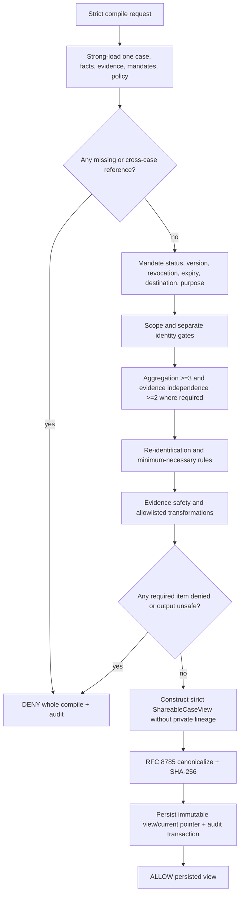

# Deterministic privacy compiler and ShareableCaseView

## Boundary and contract

The privacy compiler is deterministic Python with no LLM/Strands/Bedrock dependency. It runs in a dedicated Lambda, performs its own strongly consistent reads from the Core table, creates safe evidence derivatives, writes immutable views to the Shareable table, and emits append-only audit events. It is the only principal allowed to create `SHAREABLE_VIEW` items.

The same Lambda exposes two typed operations behind separate IAM actions in application code:

1. `CompileShareableView`: evaluate facts and produce `ALLOW + view` or `DENY + reasons`.
2. `AcquireSendAuthorizationFence` / `ReleaseSendAuthorizationFence`: revalidate a view/proposal/approval snapshot immediately before SES and briefly fence authorization changes. It never returns private data to the sender.

Compiler functions accept domain objects through repository ports and are pure except for the composition layer that loads, stores, copies safe evidence, and audits.

## Compile command

`CompileCommand` fields are:

| Field | Type | Rule |
|---|---|---|
| `compile_id` | UUID | idempotency identity |
| `namespace` | Namespace | caller cannot compile across namespace |
| `case_id` | CaseId | authoritative case |
| `expected_case_version` | positive int | stale caller denied; compiler still loads current |
| `requested_facts` | tuple 1–100 | `{fact_id, necessity: REQUIRED|OPTIONAL, intended_usage: CLAIM|AGGREGATION_INPUT|EVIDENCE}` |
| `requested_evidence_ids` | tuple 0–20 | each must be tied to a requested fact |
| `destination` | `{destination_id, kind=PROPERTY_MANAGER, registry_version, routing_token, display_label}` | safe metadata from the versioned registry; no address/contact value |
| `purpose` | literal `REQUEST_ELEVATOR_REPAIR_AND_RESPONSE` | policy/v1 only |
| `requested_at` | UTC datetime | injected application clock |
| `policy_version` | literal `policy/v1` | must equal deployed active policy |
| `compiler_contract_version` | literal `compiler/v1` | reject unknown |

The application generates candidates from active case facts; neither an LLM nor the compiler invents facts. `REQUIRED` means the action is invalid without the fact and an ineligible required fact denies the compile. An ineligible `OPTIONAL` fact is omitted and audited. Structural/cross-case errors always deny the whole compile regardless of necessity. At least one externally useful fact must remain.

## Scope semantics in policy/v1

Scopes are capabilities, not a simple numeric ordering:

| Scope | Permitted output |
|---|---|
| `INTERNAL_ONLY` | never exported |
| `AGGREGATE_ONLY` | only a compiler-created aggregate/generalization backed by at least 3 distinct contributors; no source-level text or identity |
| `ANONYMOUS_CASE` | a standalone anonymous case fact; no contributor identity, unit, contact, health detail, verbatim private quote, or direct evidence bytes |
| `NAMED_CASE` | a case fact may include the contributor's approved display-name fact only when `identity_grant.externally_shareable=true`; content and identity grants must both pass |
| `EXTERNAL_ACTION` | a fact or clean safe evidence derivative may support the specified outbound action; it does not imply identity permission |

For the property-manager repair request, `ANONYMOUS_CASE`, `NAMED_CASE`, and `EXTERNAL_ACTION` may produce claims as their semantics allow. `EXTERNAL_ACTION` is required for a direct safe evidence attachment/reference. `AGGREGATE_ONLY` contributes only to an aggregate fact. An `ANONYMOUS_CASE` incident date may be exported; a photo requires `EXTERNAL_ACTION`; a name still requires a separate identity grant.

Policy/v1 hard-codes `UNIT_LOCATION`, `HEALTH_DETAIL`, contact values, minors' identities, and private S3/object identifiers as non-exportable even if a malformed mandate purports to allow them. Authorization is necessary but never sufficient.

## Exact evaluation order

Evaluation is stable and stops as specified. Reason codes are enums; no private value is included in a reason.

1. **Request/schema:** strict shape, bounds, duplicate IDs, recognized policy/compiler versions. Failure: whole `DENY INVALID_REQUEST`.
2. **Namespace/community:** load case by namespace; caller/case community must match. Failure: whole `DENY CASE_NOT_FOUND_OR_FORBIDDEN` (non-enumerating).
3. **Case identity/version:** current case exists, active, and equals expected version. Failure: whole `DENY STALE_CASE_VERSION`.
4. **Cross-case references:** batch-get every requested fact/evidence; any item whose case/community differs is `DENY CROSS_CASE_REFERENCE`. Missing and foreign IDs are deliberately not silently skipped.
5. **Fact/evidence existence:** any nonexistent requested ID is whole `DENY FACT_NOT_FOUND`/`EVIDENCE_NOT_FOUND`.
6. **Ownership/contributor:** each fact has a contributor owner and lineage matches its report/message; ownerless contributor facts deny that item, and malformed ownership denies whole compile as integrity failure.
7. **Current mandate selection:** load the strongly consistent current mandate pointer for every source contributor/fact. Missing current mandate makes required item deny; optional item excludes.
8. **Mandate version integrity:** pointer version, immutable record, `terms_hash`, fact ID, case ID, and contributor ID must agree. Any mismatch is whole `DENY MANDATE_INTEGRITY_ERROR`.
9. **Mandate approval:** status must be `APPROVED` and decision actor must own the mandate. Refused/proposed/superseded items do not authorize.
10. **Revocation:** a later current version or `revoked_at <= requested_at` denies. Revocation is checked before expiration for unambiguous audit.
11. **Expiration/time:** `valid_from <= requested_at < expires_at` when expiry exists. Equality at expiry is expired.
12. **Destination permission:** exact destination ID/kind/current registry version/opaque routing token must match compiler configuration and be allowed; no wildcard destination in V1.
13. **Purpose permission:** exact purpose must be in the mandate and the policy purpose table.
14. **Disclosure scope:** fact grant scope must permit its intended usage under the table above. `INTERNAL_ONLY` always excludes/denies.
15. **Identity permission:** identity values require both a content grant for that identity fact and a true identity grant at `NAMED_CASE`/`EXTERNAL_ACTION`. Otherwise they are excluded; other facts remain anonymous.
16. **Aggregation threshold:** `AGGREGATE_ONLY` groups by compiler rule and requires at least `AGGREGATE_PRIVACY_MIN=3` distinct contributor IDs after eligibility. Under-threshold required aggregate denies; optional aggregate excludes.
17. **Contributor/evidence independence:** contributor count uses unique contributor IDs; corroboration uses unique contributor plus collapsed `EvidenceRoot`. Forwarded/duplicate roots cannot increase evidence sufficiency. `CORROBORATION_MIN=2` is rechecked but never substituted for privacy count. This gate evaluates **case** corroboration only: the case's stored `corroboration_source_count` is written by the investigation apply from the same deterministic function the compiler re-runs, and the gate takes the minimum of the two, so a stale stored value can only deny and never allow. A `ShareableFact.evidence_status` of `CORROBORATED` is a separate **fact-level** determination made under [ADR-015](../adr/ADR-015-evidence-status-and-verification.md) and is never inferred from this gate. Collapsing a forwarded root requires the root-ID locator of [ADR-017](../adr/ADR-017-evidence-root-id-locator.md); a missing locator fails the gate closed rather than under-counting silently.
18. **Re-identification risk:** rule-based checks reject unit labels, unique relationship/health combinations, direct quotes, precise timestamps when uniqueness is high, and aggregates with a single category bucket. V1 has no LLM risk classifier and no exception path.
19. **Minimum necessity:** policy/v1 purpose allowlist selects only incident count/date range, common-area/elevator location, failure/impact category, evidence status, non-sensitive contradiction, requested repair/action, and approved safe evidence. Redundant facts are deterministically deduplicated. Permission alone does not cause inclusion.
20. **Evidence safety:** source item must be same case, malware status `CLEAN`, allowed MIME/size, non-private for intended use, and backed by an approved `EXTERNAL_ACTION` grant. Unsafe, text-bearing prompt-injection, health/unit/name-bearing, or unscanned evidence is not exported.
21. **Safe transformation and construction:** execute only versioned allowlisted transformation functions, build separate `ShareableFact`/`ShareableEvidenceRef` types, then run negative-field/secret/URI scanners. Any transformation error denies the whole compile.
22. **Audit and hash:** canonicalize the complete view without `view_hash`, compute hash, conditionally persist view/current pointer and append audit decision. Persistence conflict returns typed conflict; it never returns an unpersisted ALLOW artifact.

An integrity, structural, cross-case, stale, transformation, or persistence problem denies the whole compile. Policy ineligibility can exclude only `OPTIONAL` inputs. `CompileDecision` includes `included` and `excluded` entries by opaque IDs/reason codes for the private UI; exclusion details are not part of the Action Agent input.



## Minimum-necessary transformation rules

The compiler registry is a Python mapping keyed by `(policy_version, purpose, fact_type, scope, intended_usage)`; it is not a user-authored DSL.

| Rule ID | Input | Output | Important constraints |
|---|---|---|---|
| `p1.incident.anonymous.v1` | one or more approved incident facts | date/date-range + failure mode | dates at day precision; no contributor/unit |
| `p1.impact.aggregate.v1` | approved aggregate-only impacts | count + generalized category | contributor count >=3; no narrative |
| `p1.impact.anonymous.v1` | approved anonymous impact | generalized impact sentence | strips relationship/health/identity |
| `p1.contradiction.safe.v1` | management statement + contradictory incident facts | neutral contradiction statement | cites safe facts; no private quote unless explicitly safe; **reserved — see below** |
| `p1.evidence.photo.v1` | approved clean elevator photo | re-encoded image derivative + caption | strips EXIF, OCR gate, no faces/unit/name; human review required in V1 |
| `p1.identity.named.v1` | approved identity fact + identity grant | display name | never contact/unit; off by default in demo |

`p1.contradiction.safe.v1` and `FactType.CONTRADICTION` are **reserved and currently unreachable in V1**: no component creates a contradiction fact. The Investigator records contradictions in its `InvestigationAssessment` and the investigation apply sets `evidence_status=CONTRADICTED` on the affected *existing* facts, which is what travels outward — `ShareableFact` already carries `evidence_status`, so an externally eligible contradicted fact can be caveated by the Action proposal without a separate contradiction fact existing. A future producer requires its own ADR ([ADR-015](../adr/ADR-015-evidence-status-and-verification.md)).

The demo malicious instruction and `mother_health_condition`, apartment number, mother name, and raw messages have no permitted rule and are excluded/denied. The photo is exported only from a clean, reviewed derivative; the Action input receives its safe reference/caption, not the image bytes or URL.

## ShareableCaseView schema

```text
ShareableCaseView
  schema_version: literal "shareable-case-view/v1"
  view_id: UUID
  case_id: UUID
  community_public_label: str[1..120]
  case_version: positive int
  policy_version: literal "policy/v1"
  compiler_version: semantic build identifier
  destination: SafeDestination
    { destination_id, kind, registry_version, routing_token, display_label }
  purpose: Purpose
  generated_at: UTC datetime
  expires_at: UTC datetime                 # min(generated_at + 15m, earliest relied-on mandate expiry)
  mandate_version_set: sorted tuple[MandateVersionRef, ...]
    MandateVersionRef { mandate_id, version, terms_hash }
  authorization_snapshot_hash: Sha256Digest
  shareable_facts: sorted tuple[ShareableFact, ...]
  safe_evidence_refs: sorted tuple[ShareableEvidenceRef, ...]
  audit_refs: sorted tuple[UUID, ...]       # opaque compiler audit IDs
  view_hash: Sha256Digest
```

`mandate_version_set` contains only mandates actually relied upon by included facts, with opaque UUIDs and terms hashes—not contributor IDs, statuses, terms, or contacts. `expires_at` is the earlier of the policy/v1 15-minute lifetime and the earliest expiry among those relied-on mandates, so the artifact cannot outlive its grant. `authorization_snapshot_hash` covers the current case version, current policy build hash, and **all evaluated current mandate pointer/version/terms hashes**, including optional excluded candidates. This makes a relevant authorization change stale even if the current visible content would coincidentally look the same.

`SafeDestination.routing_token` is a random UUID rotated whenever the actual recipient routing changes; it is not derived from the email address. The compiler has only the safe registry metadata. The sender secret contains the same token/version and the actual verified address; a mismatch is stale authorization.

`ShareableCaseView` explicitly has no fields for raw text, private summary, contributor owner/pseudonym/contact, apartment/unit, health, relationship, private evidence key/URI, extracted private evidence, exclusions, mandate terms/status, model prompts, or generic metadata. Pydantic uses `extra='forbid'`; a final recursive denylist rejects key names matching `raw|private|contact|email|unit|apartment|health|uri|object_key|mandate_record`.

## Canonical serialization and hashes

1. Convert the strict model to JSON-compatible primitives with all defined fields present, `None` as JSON `null`, enums as strings, UUIDs lowercase, and datetimes normalized to six-digit UTC `Z`.
2. Sort `mandate_version_set` by mandate UUID/version, `shareable_facts` by `export_fact_id`, evidence refs by ID, their safe citation IDs lexicographically, and audit refs lexicographically. Private source lineage is not part of the view. Reject duplicates before sorting.
3. Prohibit floats, NaN/infinity, arbitrary maps, non-NFC strings, and unpaired Unicode. Normalize strings to Unicode NFC; do not normalize or collapse semantic whitespace after validation.
4. Set `view_hash` absent, serialize with RFC 8785 JCS as UTF-8, and compute SHA-256.
5. Store `view_hash="sha256:" + lowercase_hex`. Add it to the persisted/returned model. Verification removes only `view_hash`, recomputes, and constant-time compares.

`view_id` and `generated_at` are compile inputs, so identical inputs including those values yield identical bytes/hash. An idempotent replay of `compile_id` returns the existing artifact. A new compile intentionally produces a new view/hash even when safe fact content is unchanged.

Authorization-sensitive changes that must increment case version and/or snapshot are: active fact/value/status/evidence-status changes; report linkage; evidence root/safety changes; mandate current version/decision/revocation/expiry correction; destination routing token/version or purpose registry change; policy/compiler version; and safe transformation review result. Presentation-only UI changes do not.

## Compile output

`CompileResult` is a discriminated union:

- `ALLOW`: `{compile_id, view, included[{fact_id, export_fact_ids}], excluded[{fact_id, reason_codes}], audit_event_id}`;
- `DENY`: `{compile_id, case_id?, current_case_version?, reasons[{code, subject_ref?, retryable}], audit_event_id}`.

The API maps policy denial to HTTP 422, stale state to 409, caller isolation failures to 404, and malformed input to 400/422 as defined in the API/error docs. An ALLOW with zero facts is impossible.

## Freshness and send authorization fence

At proposal time, application code strongly reads the current view pointer and verifies hash, case version, policy version, destination/purpose, snapshot hash, and expiry. The proposal binds `view_id/view_hash/case_version` and gets its own canonical `proposal_hash`. Approval binds both hashes exactly and expires after 15 minutes.

Immediately before rendering/SES, the sender invokes `AcquireSendAuthorizationFence` with `{execution_id, action_id, approval_id, proposal_hash, view_id, view_hash, case_version, policy_version, destination, purpose, mandate_version_set, authorization_snapshot_hash, requested_at}`.

The compiler:

1. strongly reloads current Core state and policy;
2. verifies the persisted view/proposal/approval hashes from Shareable via passed values and compiler-readable safe records;
3. repeats case, policy, destination, purpose, expiry, current mandate/version/revocation, and snapshot checks;
4. conditionally creates `SEND_FENCE#case_id` with the execution ID and expiry `min(requested_at + 60 seconds, view expiry, approval expiry, earliest relied-on mandate expiry)`; fewer than five seconds of remaining authority denies instead of racing.

Mandate decisions, revocations, and authorization-sensitive case mutations conditionally require no unexpired send fence. A concurrent revocation arriving after the fence returns a retryable 409 for at most 60 seconds; therefore the total order is explicit: either revocation commits first and send is denied, or send authorization commits first and the later revocation cannot unsend it. The sender checks its injected clock is still strictly before fence expiry immediately before the SES call, must call SES within the fence, then releases it in `finally`. Expired authority causes a definite pre-send stale failure. A crashed/expired fence paired with a `SENDING` execution is reconciled to `SEND_UNKNOWN`, never retried automatically.

```mermaid
sequenceDiagram
    participant U as Contributor
    participant C as Compiler boundary
    participant S as Sender
    participant SES as Amazon SES
    Note over C: T1 view compiled
    alt revoke commits before send fence
      U->>C: T2 revoke mandate
      C-->>U: committed; case/snapshot version changed
      S->>C: T3 acquire fence with old snapshot
      C-->>S: DENY STALE_AUTHORIZATION
    else send fence commits first
      S->>C: acquire current snapshot fence
      C-->>S: ALLOW fence until T+60s
      U->>C: revoke
      C-->>U: 409 SEND_AUTHORIZATION_IN_PROGRESS
      S->>SES: one immutable rendered message
      SES-->>S: message ID or ambiguous timeout
      S->>C: release fence
      U->>C: retry revocation; commit
    end
```

Previously sent messages cannot be recalled. The audit trail states the authorization snapshot and ordering without storing private content.
