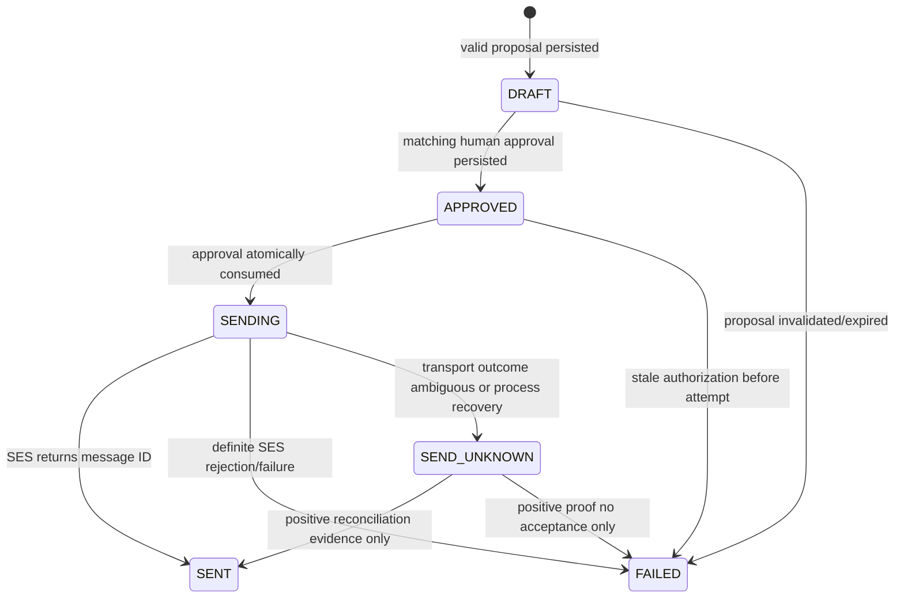

# Action authorization, SES, and commitment watcher

## Action pipeline

```mermaid
sequenceDiagram
    participant API as Application API
    participant DDB as Shareable table
    participant AC as Action Agent
    participant H as Human approver
    participant PC as Privacy compiler boundary
    participant S as Sender Lambda
    participant SES as Amazon SES
    API->>DDB: strong read current view
    API->>AC: ShareableCaseView only
    AC-->>API: structured ActionProposalDraft
    API->>API: validate IDs, facts, hashes, language constraints
    API->>DDB: persist immutable proposal + DRAFT execution
    H->>API: approve exact proposal_hash + view_hash
    API->>DDB: approval + execution APPROVED
    API->>S: execute by case/action/execution IDs
    S->>DDB: consume approval; APPROVED -> SENDING
    S->>PC: acquire current authorization fence
    PC-->>S: ALLOW fence or stale DENY
    S->>S: deterministic render + hash
    S->>SES: one SendEmail call with execution tag
    alt accepted
      SES-->>S: SES message ID
      S->>DDB: SENDING -> SENT
    else explicit failure
      SES-->>S: definite error
      S->>DDB: SENDING -> FAILED
    else timeout/ambiguous transport
      S->>DDB: SENDING -> SEND_UNKNOWN
    end
    S->>PC: release fence
    Note over API,DDB: Application worker reads terminal execution and idempotently applies the matching case transition
```

No stage accepts a model-authored email body. Approval is authorization for one attempt, not proof of execution.

The application worker, not the sender role, owns the private `CommunityCase` projection. After sender return—or on replay after a lost return—it strongly reads the execution: `SENT` conditionally moves `ACTION_PROPOSED→ACTIONED`; `FAILED/SEND_UNKNOWN` leaves the case proposed and adds the safe execution banner. Thus sender needs no Core access, and a worker crash cannot lose a sent result.

## Deterministic proposal validation

The validator loads the persisted current view by case/view ID with a strong read and performs these checks in order:

1. proposal schema, size, enum, and `extra='forbid'`;
2. exact case ID/version, view ID/hash, destination, purpose, and non-expired view;
3. view hash recomputation and current pointer equality;
4. unique claim IDs and 1–12 claims;
5. every cited export fact exists in that exact view and every citation set is nonempty;
6. every request/caveat factual premise has citations; caveats with no premise may have zero citations;
7. no fact/claim/evidence ID outside the view; foreign IDs are a whole-proposal `AGENT_CONTRACT_VIOLATION` and security audit;
8. subject contains no CR/LF/control characters and is 1–120 Unicode characters;
9. claim/request/caveat text contains no HTML, Markdown images, `mailto:`, raw URL, email, apartment/unit pattern, phone pattern, or denylisted sensitive term/token not present in a safe fact;
10. numbers, dates, quoted strings, and proper-name candidates in factual text must be lexically supported by at least one cited fact's `safe_text`; false positives deny and require re-proposal rather than manual bypass;
11. normalized text and citations do not duplicate another claim;
12. canonical `proposal_hash` recomputation and conditional persistence.

These checks do not prove natural-language truth; they bound the proposal to compiled source facts. The human preview remains mandatory. A human cannot edit text in place: requested edits produce a new proposal and hash, then a new approval.

## Proposal and execution lifecycle

Each validated proposal creates one `ActionExecution` in `DRAFT`. States and legal transitions are:



There is no transition out of `SENT`. V1 has exactly one execution/attempt per action proposal (`attempt_number=1`). `FAILED` is terminal for that action; another attempt requires a freshly validated proposal with a new action/execution ID and a new human approval. `SEND_UNKNOWN` is quarantined from all automatic/manual retry commands; reconciliation changes only the recorded outcome and never sends.

## Human approval contract

The approval request supplies `action_id`, `expected_action_status`, `view_hash`, `proposal_hash`, decision, and idempotency key. The UI displays exactly the deterministic rendered preview that the sender will reconstruct, plus destination label, view/policy versions, expiry, and safe citations. Approval:

- binds exact case/action/view/proposal/template-version hashes;
- is created by a fixed demo approver actor after access-token validation;
- expires after 15 minutes and before the view if that is earlier;
- can be consumed once by one execution;
- does not authorize changed text, recipient, destination, purpose, attachment, template, or view;
- is never inferred from a button page load or agent output.

Concurrent approvals use a conditional `attribute_not_exists(active approval)`; an exact replay returns the original, a second different decision conflicts. Rejection leaves the case `ACTION_PROPOSED` until the human re-proposes or closes.

## Deterministic rendering

Renderer version `email/property-manager/v1` takes only `ActionProposal` and its bound `ShareableCaseView`, including the safe destination display label/version/token. It sorts claims in proposal order, escapes all text, and produces UTF-8 plain text plus escaped HTML from the same intermediate document tree.

```text
Subject: {validated subject}

Hello Property Management,

Ambient CHORUS identified a recurring elevator issue reported by community members.

Evidence-backed observations
1. {claim text} [C1]
...

Requested action
{requested_action}
Requested response date: {date or "Please confirm a schedule."}

Caveats
- {caveat}

References
C1: {short export fact IDs}

Case reference: {case_id}
This message was compiled from contributor-authorized, minimum-necessary facts.
```

The fixed framing sentence is template copy, not a model claim; the case must meet corroboration before action. The renderer never accesses private types. It rejects a message over 100 KiB, strips no content silently, and hashes canonical `{template_version, from_identity_id, destination_id, destination_registry_version, routing_token, subject, text_body, html_body}`. V1 sends no attachment or live evidence URL; the safe photo is visible in the external-safe UI and can be added to a later deterministic attachment policy by ADR.

## Destination and SES controls

- `destination_id=property_manager:demo` resolves in a Secrets Manager destination registry to one SES-verified address, safe display label, monotonically increasing registry version, and random routing token. The view contains the label/version/token but never the email address. Sender requires exact version/token equality and denies after any routing change.
- Sender refuses any destination absent from both the registry and view, any unverified environment, and any recipient count other than one.
- `From` is a verified CHORUS identity; Reply-To is a controlled demo inbox. No BCC/CC in V1.
- SES v2 configuration set `chorus-{environment}` publishes send/delivery/bounce events with an `execution_id_hash` email tag. The sender stores the returned SES message ID.
- SES sandbox restrictions are accepted for the hackathon; moving out of sandbox is a deployment prerequisite, not an application fallback.

## Idempotency and ambiguous sends

Execution idempotency key is `sha256(namespace | action_id | execution_id | proposal_hash | view_hash | approval_id)`. API double-clicks, Lambda retries, and repeated sender invokes load the existing execution:

- `DRAFT`/`APPROVED`: only the legal next CAS may proceed;
- `SENDING`: return 202 “in progress”; never issue another SES call;
- `SENT`: return the same success/message reference;
- `FAILED`: return the terminal failure; a new proposal/action/approval is required if safe;
- `SEND_UNKNOWN`: return 409 quarantine; no retry endpoint exists.

SES `SendEmail` has no application-level guarantee that makes a timed-out call safe to repeat. The `ses_request_token_hash` and email tag aid correlation but are not treated as SES deduplication.

If a sender process dies while `SENDING`, a reconciliation task after the 60-second fence expiry marks it `SEND_UNKNOWN` unless a recorded SES event positively proves acceptance. Configuration-set events may transition `SEND_UNKNOWN→SENT` when the execution tag and message ID match. An operator may inspect SES events and the controlled inbox; `SEND_UNKNOWN→FAILED` requires positive evidence that SES never accepted the call. Uncertainty remains unknown indefinitely rather than risking a duplicate.

## Failure/retry classification

| Situation | Execution result | Automatic retry? | Next human action |
|---|---|---:|---|
| stale view/mandate/policy before fence | `FAILED/STALE_AUTHORIZATION` | no | recompile, re-propose, reapprove |
| SES validation/rejected recipient | `FAILED/SES_REJECTED` | no | fix destination/config, create and approve a fresh proposal |
| SES explicit throttling/5xx response | `FAILED/SES_DEFINITE_FAILURE` | no in V1 | wait, create and approve a fresh proposal |
| client timeout/connection reset after call begins | `SEND_UNKNOWN` | never | reconcile only |
| process crash in `SENDING` | `SEND_UNKNOWN` after recovery window | never | reconcile only |
| conditional conflict/double-click | existing state | safe state read only | none |

## External reply and commitment creation

A manager email is ingested as private `EvidenceItem` and `ExternalReplyReceived`; no email text enters the shareable table. The Investigator receives the bounded reply text as untrusted evidence and may return a cited `proposed_commitment`. Deterministic validation requires:

- source evidence belongs to the same case and is an approved destination reply;
- obligor matches the destination's safe organization label;
- due time is explicitly supported by the cited reply, in UTC after timezone conversion, between 1 hour and 30 days after receipt;
- action text is 1–500 characters and contains no private resident data, instruction/control text, URL, or unsupported date/number;
- verification method is V1 fixed `AFFECTED_CONTRIBUTOR_CONFIRMATION`;
- at most one active commitment per action/due term; duplicate evidence/root returns existing commitment.

The application, not the agent, assigns the commitment ID, stores safe terms, and moves `ACTIONED→VERIFYING`. A malicious reply can at most fail validation; it cannot change policy, close a case, trigger SES, or choose an arbitrary target.

## Scheduler flow

```mermaid
sequenceDiagram
    participant A as Application
    participant T as Shareable table
    participant E as EventBridge Scheduler
    participant W as Watcher Lambda
    participant U as Affected contributor
    A->>T: create PENDING commitment
    A->>E: CreateSchedule deterministic name/token
    E-->>A: schedule ARN
    A->>T: attach schedule generation
    E->>W: CommitmentDueEvent (delivery may repeat)
    W->>T: conditional PENDING -> DUE; request verification
    U->>A: fulfilled or missed verification
    alt fulfilled
      A->>T: DUE -> FULFILLED; case -> RESOLVED
    else missed
      A->>T: DUE -> MISSED; case -> READY_FOR_ACTION
    end
    E->>W: possible duplicate
    W-->>E: no-op success from recorded event ID/state
```

Schedule name is `chorus-{env}-{namespace_hash8}-{commitment_id}-{generation}`. Create uses a deterministic client token and exact-name reconciliation. Configuration: one-time `at(...)`, UTC, flexible window `OFF`, `ActionAfterCompletion=DELETE`, maximum event age 1 hour, maximum retry attempts 3, and an encrypted standard SQS DLQ. Payload:

```json
{
  "schema_version": "commitment-due/v1",
  "event_id": "uuidv5(commitment_id,generation)",
  "namespace": "DEMO",
  "case_id": "uuid",
  "commitment_id": "uuid",
  "expected_generation": 1,
  "logical_due_at": "2030-01-16T12:00:00.000000Z"
}
```

The watcher strongly loads the commitment, verifies namespace/case/generation/due time, records the event ID, and conditionally changes `PENDING→DUE`. Duplicate or late delivery after `DUE/FULFILLED/MISSED/CANCELLED` returns success with an audit replay marker. A scheduler failure leaves the commitment visibly `PENDING_SCHEDULE` (an operational projection) and retries creation by same name/token; it does not pretend verification is scheduled. DLQ depth and dropped invocations alarm.

## Demo clock without scheduler theater

Reset seeds fixed logical timestamps. In `demo`, the scheduler adapter maps logical delay to a real future wall time (`actual_now + max(10 minutes, logical_due-logical_now)`) and records both values. Thus a real EventBridge schedule is created, but demo success does not depend on a precise firing window.

The presenter advances the demo clock through an access-controlled `/v1/demo/clock/advance` command. That command invokes the same watcher Lambda with the same signed `CommitmentDueEvent` and a `trigger=DEMO_CLOCK` audit field; it does not mutate commitment outcome directly. The real later schedule invocation is a harmless replay. Fulfilled/missed still requires the contributor verification endpoint. This preserves a live watcher path and deterministic timing.

## Resolution semantics

- `SENT` moves the case to `ACTIONED`, never `RESOLVED`.
- Creating a commitment or explicit verification request moves it to `VERIFYING`.
- Due time requests verification; time passage alone does not prove failure.
- An affected contributor's `FULFILLED` decision resolves the case.
- A `MISSED` decision moves the commitment to `MISSED` and case to `READY_FOR_ACTION`; a subsequent action needs a fresh view/proposal/approval.
- No manager message, agent output, scheduler event, or absence of reports can mark `RESOLVED`.
