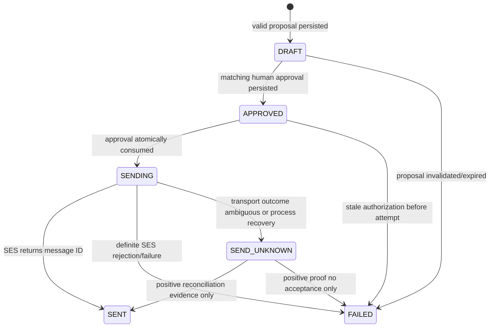

# Action authorization, SES, and commitment watcher

## Action pipeline

```mermaid
sequenceDiagram
    participant API as Application API
    participant DDB as Shareable table
    participant AC as Action Agent
    participant H as Human approver
    participant PC as Privacy compiler boundary
    participant S as Sender Lambda
    participant SES as Amazon SES
    API->>DDB: strong read current view
    API->>AC: ShareableCaseView only
    AC-->>API: structured ActionProposalDraft
    API->>API: validate IDs, facts, hashes, language constraints
    API->>DDB: one ten-participant transaction: proposal + DRAFT execution + pointers + case READY_FOR_ACTION->ACTION_PROPOSED
    H->>API: approve exact proposal_hash + view_hash + preview_hash
    API->>DDB: immutable approval + execution APPROVED
    API->>S: execute by case/action/execution IDs
    S->>DDB: strong-load proposal, view, approval, execution
    S->>S: deterministic render + hash; require it equals the approved preview_hash
    S->>DDB: APPROVED -> SENDING (the claim CAS, writing this attempt's claim owner)
    S->>DDB: strong read; require SENDING carries THIS attempt's claim owner
    S->>PC: acquire current authorization fence
    PC->>PC: take the fence, then revalidate the case side from inside it
    PC-->>S: ALLOW fence or stale DENY
    S->>S: resolve recipient and identity; re-read the clock against the fence expiry
    S->>SES: one SendEmail call with execution tag
    alt accepted
      SES-->>S: SES message ID
      S->>DDB: SENDING -> SENT
    else explicit failure
      SES-->>S: definite error
      S->>DDB: SENDING -> FAILED
    else timeout/ambiguous transport
      S->>DDB: SENDING -> SEND_UNKNOWN
    end
    S->>PC: release fence
    Note over API,DDB: Application worker reads terminal execution and idempotently applies the matching case transition
```

No stage accepts a model-authored email body. Approval is authorization for one attempt, not proof of execution.

**Rendering precedes the claim, and the order is normative** ([ADR-025](../adr/ADR-025-one-deliberate-ses-attempt.md) § 3). `rendered_message_hash` is required the moment an execution reaches `SENDING`, so a claim that ran before the render would have to write a digest of bytes nobody had produced. Rendering is a pure function of immutable inputs with no side effect, so moving it earlier costs nothing and is what makes the approved-equals-sent comparison happen *before* anything is consumed.

**The duplicate-send boundary is the claim compare-and-swap, not the fence.** The fence is per case and admits a replay by the same `execution_id`; it exists to order a send against a mandate revocation. What guarantees at most one deliberate SES call per execution is the conditional `APPROVED@v → SENDING@v+1` write, together with the rule that no code path issues an SES call from `SENDING` or from any terminal state.

**The claim is proved by the row, not by the commit's own answer.** The write carries `claim_owner_hash`, minted per attempt, and the sender then strongly reads the execution and requires `SENDING` carrying *its own* owner before anything external happens. Without that, a worker whose claim transaction had an ambiguous outcome resolved it against a commit proof keyed on the execution — a proof another worker had written — and concluded that it held a claim it did not ([ADR-025](../adr/ADR-025-one-deliberate-ses-attempt.md) § 1).

**Send-time authorization is revalidated from inside the fence, never before it.** The compiler acquires the fence first and only then re-derives every case-side fact, because validating first leaves a window nobody owns: a revocation committing between the two is invisible to the validation, which has already run, and to the acquisition, which checks only the fence. A denial releases the fence immediately (§ 4 of the same ADR).

**The clock is sampled once more immediately before the call.** The fence expiry check happens after acquisition and again after the destination and sending-identity resolutions have been awaited, because a clock read that a later `await` can invalidate is not a check on the instant that matters. The fence expiry is the minimum of every relevant authority's expiry, so one comparison covers them all.

The application worker, not the sender role, owns the private `CommunityCase` projection. After sender return—or on replay after a lost return—it strongly reads the execution: `SENT` conditionally moves `ACTION_PROPOSED→ACTIONED`; `FAILED/SEND_UNKNOWN` leaves the case proposed and adds the safe execution banner. Thus sender needs no Core access, and a worker crash cannot lose a sent result.

## Deterministic proposal validation

The validator loads the persisted current view by case/view ID with a strong read, loads the Core case with a strong read, and performs these checks in order. Every failure is a **whole-proposal** rejection under a bounded `ActionRejection` code; there is no per-claim salvage.

1. proposal schema, size, enum, and `extra='forbid'`;
2. exact case ID, case state `READY_FOR_ACTION`, expected OCC `version`, `authorization_version` equal to the view's, view ID/hash, purpose, and non-expired view; and the **current deployment configuration** by exact equality — `policy_version`, `compiler_version`, `policy_build_hash`, and the destination's `destination_id`, `kind`, `registry_version`, `routing_token`, and `display_label`. These last are deployment-owned rather than case-owned ([ADR-020](../adr/ADR-020-case-authorization-version.md) § 3), so a verified `authorization_snapshot_hash` is **not** evidence about them: it proves the old view is internally coherent, which a view compiled by a superseded policy build or against a rotated registry entry also is. Every one of these is checked before any model call;
3. view hash recomputation and current pointer equality;
4. unique claim IDs and 1–12 claims; unique caveat IDs and 0–8 caveats;
5. every cited export fact exists in that exact view, and **every citation set on every claim, on the request, and on every caveat holds 1–10 IDs**. There is no zero-citation path;
6. every relied-upon fact whose `ShareableFact.evidence_status` is `CONTRADICTED` is cited by at least one caveat, where relied-upon means cited by a claim or by the request. A missing caveat is `CONTRADICTED_FACT_NOT_CAVEATED`;
7. no fact/claim/evidence ID outside the view; foreign IDs are a whole-proposal `AGENT_CONTRACT_VIOLATION` and security audit;
8. subject contains no CR/LF/control characters and is 1–120 Unicode characters;
9. none of the four **model-authored textual fields** — `subject`, every claim text, `requested_action`, every caveat text — contains a rejected construct: control, bidi, or invisible characters, markup, Markdown link or image syntax, a URL, `mailto:`, an email address, a telephone or apartment/unit pattern, a quotation mark outside a word-internal apostrophe, a UUID or `sha256:` identifier shape, a non-ISO date construct, or any match of the compiler's own sensitive-term pattern. The telephone rule runs **after** ISO-date span validation and exempts a span that is exactly one valid calendar date, so the only permitted date form is not rejected by the pattern that would otherwise match it. This check reads prose only: the typed contract identifiers are validated by checks 2, 5, and 7;
10. every risk token — ISO date, clock time, ordinal, number, or number word — extracted from model text is matched exactly by a token of the same kind in a cited fact's `safe_text`, and every proper-name candidate occurs in a cited `safe_text`, the destination display label, the community public label, or the reviewed template-copy allowlist;
10a. `requested_deadline`, when present, is strictly after `view.generated_at` ([ADR-021](../adr/ADR-021-action-grounding-and-caveats.md) § 10), rejected as `DEADLINE_NOT_AFTER_VIEW`. Equality is a rejection. The contract type owns the shape — a timezone-aware UTC instant — and stops there, because a contract has no view to compare against; the comparison is this layer's because the bound is a property of the artifact the proposal is made against. An absent deadline stays legal;
11. no two claims and no two caveats share the same comparison-normalized text;
12. canonical `proposal_hash` recomputation and conditional persistence.

Checks 5, 6, 9, 10, and 11 are frozen in exact detail — the normalization, the rejected constructs, the token grammar, the support comparison, and the proper-name detector — by [ADR-021](../adr/ADR-021-action-grounding-and-caveats.md). Two points there change what earlier drafts of this section said and are stated here so the difference is not read as an omission:

- **Every model-authored substantive field is citation-bound, and there is no factual-premise classifier.** `request_fact_ids` and every caveat's `export_fact_ids` are `1..10` and never zero. Distinguishing "please repair the elevator" from "because it failed three times, repair it" is clause-level natural-language analysis, and the only honest implementations are an unspecified parser or a second model. Requiring citations everywhere makes the question disappear. A request without a reason is also a request the recipient cannot evaluate.
- **The sensitive-term rule is absolute.** The older wording exempted a term "present in a safe fact"; compiler gate 21 runs the same scanner over the constructed view and denies the whole compile on a match, so a view satisfying that exemption cannot exist. Phase 7 rejects absolutely and reuses the compiler's pattern rather than writing a second one.

**Expiry is sampled twice, and the second sample is the load-bearing one.** Check 2 runs before the model is invoked; the injected clock is then read again immediately before the proposal is staged, and the view must still be unexpired at that instant. Expiry is the one freshness fact no transaction condition can express — the apply conditions on the case row's exact `version`, `authorization_version`, and `state`, and on the current-view pointer's exact identity, and every one of those is satisfied by a view whose `expires_at` has simply passed, because the passage of time mutates no row. That second read is an authorization freshness sample and nothing else: it is never persisted, and the command's one canonical instant still stamps every artifact the apply writes, so one apply still produces one coherent set of rows. Equality at expiry means expired, and a view that expired mid-invocation fails the proposal whole — no proposal, no `DRAFT` execution, no pointer movement, no history locator, no successful invocation record, no case transition, and **no second model call**.

These checks do not prove natural-language truth; they bound the proposal to compiled source facts. **A false positive rejects and requires a re-proposal — never a bypass, never an override, and never adjudication by a second model.** The human preview remains mandatory. A human cannot edit text in place: requested edits produce a new proposal and hash, then a new approval.

## Proposal and execution lifecycle

Each validated proposal creates one `ActionExecution` in `DRAFT`. That `DRAFT` carries no `approval_id`, no send `idempotency_key`, no `rendered_message_hash`, and no `ses_request_token_hash`, because none of those exists before a human has approved anything and the send idempotency key is defined over the approval. Field presence is a function of state and is monotonic; the normative table is [ADR-022](../adr/ADR-022-action-draft-preview-and-transaction.md) § 1.

A proposal may be created only when no current action pointer exists, or when the current pointer names an `INVALIDATED` proposal whose execution is terminal `FAILED`. **A request arriving while a valid current `DRAFT` stands is a conflict, refused before any model call, with nothing written.** Phase 7 never mutates an existing execution: invalidating a pointer and failing a `DRAFT` belongs to the explicit human reject-or-edit path below, because a second model call must not discard a human's pending decision without a human deciding to. Two live `DRAFT` executions for one case therefore cannot exist.

States and legal transitions are:



There is no transition out of `SENT`. V1 has exactly one execution/attempt per action proposal (`attempt_number=1`). `FAILED` is terminal for that action; another attempt requires a freshly validated proposal with a new action/execution ID and a new human approval. `SEND_UNKNOWN` is quarantined from all automatic/manual retry commands; reconciliation changes only the recorded outcome and never sends.

## Human approval contract

The approval request body is `{decision, expected_execution_version, execution_id, view_hash, proposal_hash, preview_hash}` plus the `Idempotency-Key` header, and nothing else ([ADR-023](../adr/ADR-023-approval-binding-and-immutability.md) § 2). `expected_action_status` is retired: the transaction conditions on a row version, and two ways to say "the thing I saw" is one too many. The UI displays exactly the deterministic rendered preview that the sender will reconstruct, plus destination label, view/policy versions, expiry, and safe citations. A `preview_hash` mismatch is 409.

`preview_hash` lives on the immutable `ActionProposal` and binds the exact preview a human is shown; the execution's `rendered_message_hash` is written later by the sender and binds the bytes prepared for one SES attempt. Both come from the same deterministic renderer over the same canonical tuple, so a correct system produces the same digest twice and a mismatch is a definite pre-send stale failure. Keeping them as two fields is what makes "the sender sent what the human approved" a comparison rather than a tautology ([ADR-022](../adr/ADR-022-action-draft-preview-and-transaction.md) § 2).

Approval:

- binds `case_id`, `action_id`, `execution_id`, `proposal_hash`, `view_hash`, and `authorization_version` directly, and binds `view_id`, `preview_hash`, `template_version`, `from_identity_id`, the destination routing triple, and the exact rendered bytes **transitively** through `proposal_hash`. Nothing transitively bound is copied onto the approval, because a second copy of a fact is a thing that can disagree with the first ([ADR-023](../adr/ADR-023-approval-binding-and-immutability.md) § 3);
- is created by a fixed demo approver actor after access-token validation, recorded as `approver_id_hash` with `approver_assurance = DEMO_SHARED_TOKEN`. That is single-presenter demo access control and **not** authentication of a person;
- expires at `min(approved_at + 15 minutes, view.expires_at)`;
- is **immutable**: it is written once and never updated. Consumption is a property of the execution — reaching `SENDING` *is* the consumption, one-time by compare-and-swap — so the approval digest covers only fields that never move;
- does not authorize changed text, recipient, destination, purpose, attachment, template, or view;
- is never inferred from a button page load or agent output.

**One decision per proposal, enforced by the execution's row version.** Every decision moves the `DRAFT` execution out of `DRAFT` under `expected_version`, so exactly one of any number of concurrent approvals or rejections commits and every other is a 409. An exact replay under the same key and request hash returns the original and writes nothing.

**Three human verbs clear a proposal**, all of which set the current action pointer to `INVALIDATED` — the only thing that frees the case for a new proposal:

| Verb | Legal execution state | Execution effect |
|---|---|---|
| **reject** (`decision=REJECTED` on the approvals route) | `DRAFT` | `DRAFT → FAILED / PROPOSAL_REJECTED` |
| **withdraw** (the invalidation route) | `APPROVED` | `APPROVED → FAILED / APPROVAL_WITHDRAWN` |
| **clear** (the invalidation route) | terminal `FAILED` | none; a `ConditionCheck` asserts it is already terminal |

Invalidation **refuses `SENDING`, `SENT`, and `SEND_UNKNOWN`**. A withdrawal races the sender's claim on one row and the compare-and-swap picks exactly one winner. **Rejection re-checks nothing beyond scope, the pointer, and the execution version** — a human must always be able to say no, and a reject path blocked by staleness would strand a case with a proposal nobody can approve and nobody can clear.

Every clearing verb ends by returning the case to `READY_FOR_ACTION` when readiness remains. **When readiness does not remain the transaction takes no case edge at all**: the case stays `ACTION_PROPOSED`, the participant that would have written it is a `ConditionCheck` instead, and `ACTION_PROPOSED → INVESTIGATING` stays with the deterministic readiness reconciliation that owns it — that edge bumps `authorization_version`, and a human clearing a draft message is not an authorization event ([ADR-023](../adr/ADR-023-approval-binding-and-immutability.md) § 9).

## Deterministic rendering

`template_version` is `email/property-manager/v1`. That single term names the renderer throughout; "renderer version" as a second name for the same value is retired.

The renderer takes exactly four inputs and nothing else: the validated immutable `ActionProposal`; its exact bound `ShareableCaseView`, including the safe destination display label, registry version, and routing token; `template_version`; and `from_identity_id`. It receives no recipient address, no Core state, no compiler audit projection, no private evidence, no model completion, and no destination secret, and it never imports a private type.

`from_identity_id` is safe deployment configuration — an opaque, stable identifier for the verified sending identity, never the `From` address, which only the sender ever resolves. It is in the preview hash because approval must bind *who the message claims to be from*: a preview approved for one sending identity that could be sent under another is an approval of the words and not of the letter ([ADR-022](../adr/ADR-022-action-draft-preview-and-transaction.md) § 4).

It sorts claims in proposal order, escapes all text, and produces UTF-8 plain text plus escaped HTML from the same intermediate document tree. Caveat markers reuse the claim marker vocabulary, so a caveat citing the fact behind `C2` renders `[C2]` and the References block stays one list.

```text
Subject: {validated subject}

Hello Property Management,

Ambient CHORUS identified a recurring elevator issue reported by community members.

Evidence-backed observations
1. {claim text} [C1]
...

Requested action
{requested_action}
Requested response date: {date or "Please confirm a schedule."}

Caveats
- {caveat}

References
C1: {short export fact IDs}

Case reference: {case_id}
This message was compiled from contributor-authorized, minimum-necessary facts.
```

The fixed framing sentence is template copy, not a model claim; the case must meet corroboration before action. The `Caveats` section is omitted entirely when there are none. The renderer never accesses private types. It rejects a message over 100 KiB — it never truncates, drops a section, or silently omits a caveat — and hashes canonical `{template_version, from_identity_id, destination_id, destination_registry_version, routing_token, subject, text_body, html_body}`. The three destination values come from `view.destination`, so the hash binds the routing the compiler authorized rather than whatever is configured at send time. V1 sends no attachment or live evidence URL; the safe photo is visible in the external-safe UI and can be added to a later deterministic attachment policy by ADR.

**The rendered bodies are not persisted.** Only `preview_hash` is stored; neither `text_body` nor `html_body` is written to any table. The renderer is a pure function of immutable inputs, so a stored body could only agree with a regenerated one or be a second version of the truth, and the case surface regenerates the preview on read.

## Destination and SES controls

- `destination_id=property_manager:demo` resolves in a Secrets Manager destination registry to one SES-verified address, safe display label, monotonically increasing registry version, and random routing token. The view contains the label/version/token but never the email address. Sender requires exact version/token equality and denies after any routing change.
- Sender refuses any destination absent from both the registry and view, any unverified environment, and any recipient count other than one.
- `From` is a verified CHORUS identity; Reply-To is a controlled demo inbox. No BCC/CC in V1. `from_identity_id` resolves in the sender's own registry secret to exactly one `{from_address, reply_to_address, identity_arn}` entry, so binding the opaque ID in `preview_hash` binds the whole letterhead while no artifact a model, a human, an audit row, or a log line can see contains either address.
- SES v2 configuration set `chorus-{environment}` publishes send/delivery/bounce events with an `execution_id_hash` email tag. The sender stores the returned SES message ID.
- The request is **`Content.Simple`, never `Content.Raw`**, so SES composes the `multipart/alternative` structure and every header itself and the sender never builds a header line. The exact payload — every field, every omission, both charsets, and the tag derivation — is frozen in [ADR-025](../adr/ADR-025-one-deliberate-ses-attempt.md) §§ 6–7. The email-tag value is bare lowercase hex with no `sha256:` prefix, because SES admits only `[A-Za-z0-9_-]` there.
- The IAM allow is `ses:SendEmail` on the sending-identity ARN and the configuration-set ARN only, and it is deliberately **not** narrowed with `ses:Recipients` or `ses:FromAddress`: those condition values are email addresses, and a synthesized template is a build artifact that gets read and diffed. The single-recipient rule is enforced in code against the registry and asserted by test, and a static assertion fails the build if any address-shaped string appears in the template ([ADR-024](../adr/ADR-024-execution-partition-and-sender-boundary.md) § 5).
- SES sandbox restrictions are accepted for the hackathon; moving out of sandbox is a deployment prerequisite, not an application fallback. Region is the deployment's single region, `us-east-1` by default.

## Idempotency and ambiguous sends

Execution idempotency key is `sha256(namespace | action_id | execution_id | proposal_hash | view_hash | approval_id)`. It depends on the approval, so it is `null` on a `DRAFT` and becomes required at `APPROVED` — that dependency is why a `DRAFT` cannot carry one, not an oversight.

Proposing an action is a separate command with its own two records, following the shape the asynchronous investigation already uses: a route/start reservation in the `NAMESPACE` partition binding the `Idempotency-Key` to one durable `PROPOSE_ACTION` operation and one `agent_invocation_id`, and an action-apply commit proof in the `ACTION` partition under a domain-separated key hash. They are commit proofs for two different transactions, so they are two records rather than one reused row. A replay under the same key and request hash returns the same operation and calls no model; a different request hash is `IDEMPOTENCY_CONFLICT` with zero mutations; an unknown apply outcome is resolved by reading the commit proof and the durable invocation record before any retry, never by re-invoking.

API double-clicks, Lambda retries, and repeated sender invokes load the existing execution:

- `DRAFT`/`APPROVED`: only the legal next CAS may proceed;
- `SENDING`: return 202 “in progress”; never issue another SES call;
- `SENT`: return the same success/message reference;
- `FAILED`: return the terminal failure; a new proposal/action/approval is required if safe;
- `SEND_UNKNOWN`: return 409 quarantine; no retry endpoint exists.

SES `SendEmail` has no application-level guarantee that makes a timed-out call safe to repeat. The `ses_request_token_hash` and email tag aid correlation but are not treated as SES deduplication.

**CHORUS therefore does not claim exactly-once email delivery.** The provable property is narrower and is the one every mechanism in this section serves:

> **At most one deliberate SES attempt is made per approved `ActionExecution`, and an attempt whose outcome is unknown is never repeated by any automatic or manual path.**

That is a most-once guarantee about *attempts*, not an exactly-once guarantee about *deliveries*. A message may have been delivered and recorded as `SEND_UNKNOWN`; that is the accepted residual, it is visible and alarmed, and the alternative — resending to be sure — would turn an unknown into a certainty of duplication.

The outcome classification is **`FAILED` requires proof; everything else is `SEND_UNKNOWN`**. A received SES error response proves SES processed and declined the request; a connection that never established proves no request was transmitted. Everything between those two proofs, **and every exception class not on the frozen definite list**, is unknown ([ADR-025](../adr/ADR-025-one-deliberate-ses-attempt.md) § 8). The default lands on the safe side by construction rather than by somebody remembering to extend a list.

If a sender process dies while `SENDING`, reconciliation after the 60-second fence expiry marks it `SEND_UNKNOWN` unless a recorded SES event positively proves acceptance. Configuration-set events may transition `SEND_UNKNOWN→SENT` when the execution tag and message ID match. An operator may inspect SES events and the controlled inbox; `SEND_UNKNOWN→FAILED` requires positive evidence that SES never accepted the call. Uncertainty remains unknown indefinitely rather than risking a duplicate.

Reconciliation is **one application command, `ReconcileSendOutcome`, with two named callers**: the application worker, when a replay finds an execution in `SENDING` past the recovery window with no live fence, and the trusted configuration-set **event path**, which is the only caller that can supply positive evidence. There is no HTTP route through which a caller supplies a configuration set, an execution tag, or a message identifier of its own: a message identifier is a value only SES can produce, and an endpoint accepting one would let anybody who could reach it resolve a quarantine by typing three strings (T35). Phase 8 owns the authenticate-decode-and-attest boundary; Phase 11 owns the event destination and transport that feed it. **Decoding is not provenance**, so the boundary is split into an attester the event adapter alone holds and a verifier the command holds: the adapter authenticates the transport *before* reading the envelope and mints attested evidence, and `ReconcileSendOutcome` accepts nothing else. A caller-built mapping or evidence object is refused under `UNATTESTED_EVIDENCE` before any state is read, and a deployment with no transport authenticator — which is every Phase-8 deployment — resolves nothing and leaves the quarantine standing. Nothing runs it on a timer, nothing runs it as a side effect of a read, and it never calls SES. A message ID that disagrees with one already recorded is an `IntegrityError` and never an overwrite, so a forged or tampered SES message ID is at worst a rejected reconciliation ([ADR-025](../adr/ADR-025-one-deliberate-ses-attempt.md) § 10).

**The fence is released on every terminal outcome, including `SEND_UNKNOWN`.** The fence is not the record of the attempt — the execution row is — and a fence retained as a quarantine marker would permanently refuse every future mandate decision and revocation on that case, making a contributor's ability to withdraw consent collateral damage of an ambiguous send.

## Failure/retry classification

| Situation | Execution result | Automatic retry? | Next human action |
|---|---|---:|---|
| stale view/mandate/policy before fence | `FAILED/STALE_AUTHORIZATION` | no | recompile, re-propose, reapprove |
| regenerated preview digest differs from the approved `preview_hash` | `FAILED/STALE_AUTHORIZATION` | no | recompile, re-propose, reapprove; **no SES call and no claim** |
| destination registry version, routing token, or `from_identity_id` moved after approval | `FAILED` with the specific cause code | no | recompile, re-propose, reapprove |
| SES validation/rejected recipient | `FAILED/SES_REJECTED` | no | fix destination/config, create and approve a fresh proposal |
| SES explicit throttling/5xx response | `FAILED/SES_DEFINITE_FAILURE` | no in V1 | wait, create and approve a fresh proposal |
| connection never established (connect timeout, DNS, unreachable endpoint) | `FAILED/SES_UNREACHABLE` | no | no request was transmitted; a fresh proposal and approval |
| client timeout/connection reset after call begins | `SEND_UNKNOWN` | never | reconcile only |
| any exception not on the frozen definite-failure list | `SEND_UNKNOWN` | never | reconcile only |
| process crash in `SENDING` | `SEND_UNKNOWN` after recovery window | never | reconcile only |
| conditional conflict/double-click | existing state | safe state read only | none |
| definite failure, then the human clears the proposal | pointer `INVALIDATED`; case `READY_FOR_ACTION` if readiness remains | no | the invalidation route is the only path that frees the case for a new proposal |

## External reply and commitment creation

A manager email is ingested as private `EvidenceItem` and `ExternalReplyReceived`; no email text enters the shareable table. The Investigator receives the bounded reply text as untrusted evidence and may return a cited `proposed_commitment`. Deterministic validation requires:

- source evidence belongs to the same case and is an approved destination reply;
- obligor matches the destination's safe organization label;
- due time is explicitly supported by the cited reply, in UTC after timezone conversion, between 1 hour and 30 days after receipt;
- action text is 1–500 characters and contains no private resident data, instruction/control text, URL, or unsupported date/number;
- verification method is V1 fixed `AFFECTED_CONTRIBUTOR_CONFIRMATION`;
- at most one active commitment per action/due term; duplicate evidence/root returns existing commitment.

The application, not the agent, assigns the commitment ID, stores safe terms, and moves `ACTIONED→VERIFYING`. A malicious reply can at most fail validation; it cannot change policy, close a case, trigger SES, or choose an arbitrary target.

## Scheduler flow

```mermaid
sequenceDiagram
    participant A as Application
    participant T as Shareable table
    participant E as EventBridge Scheduler
    participant W as Watcher Lambda
    participant U as Affected contributor
    A->>T: create PENDING commitment
    A->>E: CreateSchedule deterministic name/token
    E-->>A: schedule ARN
    A->>T: attach schedule generation
    E->>W: CommitmentDueEvent (delivery may repeat)
    W->>T: conditional PENDING -> DUE; request verification
    U->>A: fulfilled or missed verification
    alt fulfilled
      A->>T: DUE -> FULFILLED; case -> RESOLVED
    else missed
      A->>T: DUE -> MISSED; case -> READY_FOR_ACTION
    end
    E->>W: possible duplicate
    W-->>E: no-op success from recorded event ID/state
```

Schedule name is `chorus-{env}-{namespace_hash8}-{commitment_id}-{generation}`. Create uses a deterministic client token and exact-name reconciliation. Configuration: one-time `at(...)`, UTC, flexible window `OFF`, `ActionAfterCompletion=DELETE`, maximum event age 1 hour, maximum retry attempts 3, and an encrypted standard SQS DLQ. Payload:

```json
{
  "schema_version": "commitment-due/v1",
  "event_id": "uuidv5(commitment_id,generation)",
  "namespace": "DEMO",
  "case_id": "uuid",
  "commitment_id": "uuid",
  "expected_generation": 1,
  "logical_due_at": "2030-01-16T12:00:00.000000Z"
}
```

The watcher strongly loads the commitment, verifies namespace/case/generation/due time, records the event ID, and conditionally changes `PENDING→DUE`. Duplicate or late delivery after `DUE/FULFILLED/MISSED/CANCELLED` returns success with an audit replay marker. A scheduler failure leaves the commitment visibly `PENDING_SCHEDULE` (an operational projection) and retries creation by same name/token; it does not pretend verification is scheduled. DLQ depth and dropped invocations alarm.

## Demo clock without scheduler theater

Reset seeds fixed logical timestamps. In `demo`, the scheduler adapter maps logical delay to a real future wall time (`actual_now + max(10 minutes, logical_due-logical_now)`) and records both values. Thus a real EventBridge schedule is created, but demo success does not depend on a precise firing window.

The presenter advances the demo clock through an access-controlled `/v1/demo/clock/advance` command. That command invokes the same watcher Lambda with the same signed `CommitmentDueEvent` and a `trigger=DEMO_CLOCK` audit field; it does not mutate commitment outcome directly. The real later schedule invocation is a harmless replay. Fulfilled/missed still requires the contributor verification endpoint. This preserves a live watcher path and deterministic timing.

## Resolution semantics

- `SENT` moves the case to `ACTIONED`, never `RESOLVED`.
- Creating a commitment or explicit verification request moves it to `VERIFYING`.
- Due time requests verification; time passage alone does not prove failure.
- An affected contributor's `FULFILLED` decision resolves the case.
- A `MISSED` decision moves the commitment to `MISSED` and case to `READY_FOR_ACTION`; a subsequent action needs a fresh view/proposal/approval.
- No manager message, agent output, scheduler event, or absence of reports can mark `RESOLVED`.
