# Frontend and deterministic demo architecture

**Phase 11 reset correction:** [ADR-031](../adr/ADR-031-demo-reset-mutation-interlock.md)
requires atomic normal-mutation fencing, registration/discovery of all Monitor-created cases,
and refusal while an external-attempt reservation is unresolved. Reset rechecks durable replay
under its lock and salts seed transaction tokens with its durable reset generation. The reset
ZIP includes the frozen corpus as package-relative data; no checkout is required.

## Frontend decisions

The web app is React with strict TypeScript and Vite. TanStack Query owns server state, caching, mutation invalidation, polling, and retries. Native `fetch` is wrapped by one typed client generated with `openapi-typescript` from FastAPI's checked OpenAPI artifact. Component-local `useState` handles selection/forms; React Context holds only access-token session and selected seeded persona. No Redux, Zustand, component framework, websocket, or client-side policy logic.

CSS Modules plus shared CSS custom properties implement a small accessible design system. Private data uses a locked warm/amber panel; external-safe data uses a cool teal panel; denial uses neutral reason badges rather than alarming red unless it is an actual error. Color is never the only signal. WCAG AA contrast, keyboard operation, visible focus, semantic headings/tables, and reduced-motion behavior are required.

The browser never computes authoritative hashes, disclosure permission, evidence status, case transition, or send eligibility. It displays server results and submits exact version/hash fields from them. All responses are `no-store`; the token lives in `sessionStorage`, not local storage, logs, query strings, or analytics.

## Generated API types, never hand-written ones

There is exactly one definition of the wire shapes and it is FastAPI's. Two commands, both deterministic and both run in CI:

```text
uv run chorus-openapi export --out apps/web/openapi/openapi.json
npm --prefix apps/web run generate:api      # openapi-typescript -> src/api/schema.d.ts
```

`chorus-openapi export` builds the app from the same local container the dev server uses and writes `app.openapi()` with sorted keys and a trailing newline. The artifact is **committed** at `apps/web/openapi/openapi.json`, and CI re-runs the export and fails on any diff — a generated file that is not checked is a file that silently drifts. The generated types land at `apps/web/src/api/schema.d.ts`, are likewise committed, and are likewise diff-checked.

`apps/web/src/api/client.ts` is the only hand-written API file: one typed `fetch` wrapper that attaches the actor header, the correlation ID, and the idempotency key, and maps Problem Details onto a typed error. It declares **no request or response shapes of its own** — every one is imported from `schema.d.ts`. An ESLint rule forbids declaring an interface for a wire type anywhere under `src/`, because a hand-maintained duplicate of a generated type is a second source of truth that agrees with the first only until someone changes the server.

The private/shareable boundary of § 6 is enforced on top of the generated types: `src/api/private.ts` and `src/api/shareable.ts` re-export disjoint subsets, and `no-restricted-imports` forbids `api/private` inside `components/shareable/**`. The subsets are disjoint by construction — a type that appears in both is a boundary violation and a test asserts the intersection is empty.

## Exactly three surfaces

### 1. Ambient Signal Feed (`/`)

Components:

- `AmbientFeedPage`
- `FeedTimeline`
- `CommunityMessageCard`
- `AttachmentThumbnail` (fixture-safe presenter preview)
- `ChorusSignalBadge`
- `CandidateClusterRail`
- `OperationProgress`

Messages appear in logical time order with unrelated noise intact. Validated Monitor linkage highlights only related elevator fragments. The first deliberate reveal is “Potential recurring issue detected” with count and a link to the case. The UI never hard-codes report/message IDs or issue detection results.

### 2. Private Mandate Thread (`/mandates/:contributorId?case=:caseId`)

Components:

- `MandateThreadPage`
- `MandatePurposeCard`
- `FactPermissionRow`
- `DisclosureScopeSelect`
- `IdentityPermissionToggle`
- `DestinationPurposeSummary`
- `MandateHistory`
- `DecisionBar` (`Approve`, `Adjust`, `Refuse`, later `Revoke`)

The page shows contributor-friendly fact wording, exact proposed use/destination/expiry, content scope, and separate identity permission. Sensitive facts default to internal and cannot be upgraded past policy. Adjust submits the full replacement terms; no optimistic “approved” UI appears before the server's immutable version response.

### 3. Case + Action (`/cases/:caseId`)

Components:

- `CaseActionPage`
- `CaseStateStepper`
- `EvidenceStatusList`
- `ContradictionCard`
- `PrivacyBoundaryCompare`
  - `PrivateInvestigationPanel`
  - `ShareableExternalViewPanel`
- `PrivacyDecisionTable`
- `ActionProposalPreview`
- `ApprovalPanel`
- `ExecutionStatusBanner`
- `CommitmentTimeline`
- `VerificationPanel`
- `AuditDrawer`

`PrivacyBoundaryCompare` is always side-by-side on desktop and stacked with persistent PRIVATE/SHAREABLE labels on narrow screens. The central divider reads “Deterministic privacy compiler.” Private facts show lock/scope/exclusion reasons; the safe panel renders the exact current `ShareableCaseView`. The Action preview is the deterministic email renderer result, not raw agent text. Send controls disappear/disable on stale hashes or `SEND_UNKNOWN` with a clear recovery message.

Tabs/drawers within this page are components of the one Case + Action surface, not additional product screens.

## Query and operation behavior

- Query keys are `['feed',community]`, `['case',caseId,actorView]`, `['investigation',caseId]`, `['mandate',contributorId,caseId]`, `['audit',caseId]`, and `['operation',id]`.
- Mutations include the current server version/hash/idempotency key. Idempotency keys are UUIDs created once per user intent and retained across transport retry.
- Agent/send operations poll every second while `PENDING/RUNNING`, back off after 30 seconds, and stop at a two-minute user-visible timeout without cancelling server work.
- Native fetch retries GET once on network failure. POST is retried only by the user/client with the same idempotency key. A 409 reloads current state; it never silently resubmits a changed decision.
- Error boundaries isolate each surface. Problem Details map to specific banners/actions; raw server detail is never rendered as HTML.

## Fixed demo fixture

Logical demo clock starts `2030-01-14T09:00:00.000000Z`. IDs are UUIDv5 of `ambient-chorus/elevator-v1/{fixture-name}`. Four contributors are Resident A–D; display names/contact values exist privately but the presentation uses pseudonyms. Six elevator incidents span January 8–13.

The synthetic feed has exactly 24 messages; order and times are fixed, but the Monitor must discover links from text.

| # | Time (logical UTC) | Actor | Message purpose |
|---:|---|---|---|
| 1 | Jan 08 07:30 | chatter | package left in lobby |
| 2 | Jan 08 07:45 | A | elevator stuck at ground floor (incident 1) |
| 3 | Jan 08 10:20 | chatter | visitor parking question |
| 4 | Jan 09 08:10 | B | mother Leela was in elevator (private identity detail) |
| 5 | Jan 09 08:11 | B | elevator stopped between floors for five minutes (incident 2) |
| 6 | Jan 09 08:12 | B | mother has asthma and panicked (private health detail) |
| 7 | Jan 09 08:13 | B | “we are in apartment 4B” (private unit detail) |
| 8 | Jan 10 18:05 | C | elevator marked out of service (incident 3) |
| 9 | Jan 10 18:20 | chatter | kitchen sink leak/plumbing |
| 10 | Jan 11 09:00 | chatter | weekend social reminder |
| 11 | Jan 11 21:15 | A | doors cycle but cab will not move (incident 4) |
| 12 | Jan 11 21:30 | C | manager said nobody else reported the lift (contradiction) |
| 13 | Jan 12 06:30 | chatter | recycling bins full |
| 14 | Jan 12 06:45 | D | lift stalled at second floor (incident 5) |
| 15 | Jan 12 12:10 | chatter | package pickup |
| 16 | Jan 13 07:55 | B | E42 error and elevator unavailable; photo attached (incident 6) |
| 17 | Jan 13 08:05 | chatter | car blocking gate |
| 18 | Jan 13 08:10 | attacker fixture | malicious instruction attachment asking for names/units/health/private messages |
| 19 | Jan 13 09:40 | chatter | water pressure question |
| 20 | Jan 13 12:00 | chatter | laundry room hours |
| 21 | Jan 13 14:30 | D | asks if others received parcels |
| 22 | Jan 13 17:05 | chatter | dog found near lobby |
| 23 | Jan 13 19:00 | chatter | parking complaint |
| 24 | Jan 14 08:30 | chatter | morning greeting/building notice |

Evidence fixtures are: one JPEG elevator E42 photo, one UTF-8 malicious text document containing the supplied prompt injection, and one RFC822 management reply template: “Technician scheduled Wednesday 10–12.” The photo and malicious document are seeded as private evidence; the management reply file is staged in the fixture catalog but is not ingested/persisted until the live external-reply step. Fixed checksums are part of the seed manifest.

No reset creates a report, fact, candidate case, assessment, mandate proposal/decision, view, action, approval, execution, commitment, schedule, or verification result. Those outcomes run live. Because a mandate is case-specific, all mandate proposals/decisions are live after discovery; the presenter approves safe scopes as seeded Resident A, C, and D, and demonstrates Resident B adjusting health/unit/name to internal while allowing the anonymous incident and photo action scope.

## The local composition root

Before Phase 10 the only place an `ApiContainer` was constructed was `tests/contract/api/conftest.py`, so there was nothing a browser could be pointed at and nothing a Playwright run could drive. Phase 10 owns a real one.

```text
src/chorus/composition/local.py        build_local_container(settings) -> ApiContainer
apps/api/chorus_api/asgi.py            app = build_app(build_local_container(Settings()))
uv run chorus-api serve --port 8080    uvicorn over that factory
```

It lives under `src/chorus/composition/` rather than under `tests/`, because the harnesses and storage-driver factory that already exist are test fixtures and a shipped entry point may not import them.

What it wires, and what each of those is:

| Slot | Local implementation | Not |
|---|---|---|
| storage | in-memory driver, or DynamoDB Local | deployed DynamoDB |
| object store | `infrastructure/local/objects` | S3 |
| Monitor / Investigator / Action | `infrastructure/local/*_agent` fakes | AgentCore |
| commitment extraction | `infrastructure/local/commitment_agent` | AgentCore |
| sender | `infrastructure/local/sender` filesystem outbox | SES |
| scheduler | `infrastructure/local/scheduler` manual scheduler | EventBridge Scheduler |
| inbound replies | `infrastructure/local/inbound_mail` + `fixtures/inbound_delivery` | SES inbound |
| clock | `LogicalDemoClock` seeded from the manifest | `SystemClock` |
| dispatcher | `InProcessOperationDispatcher` | worker Lambda |

It requires **no AWS credentials**, makes **no network call**, and reaches **no** SES, AgentCore, EventBridge, S3, or deployed DynamoDB. It also wires the five Phase-9 slots the previous composition left `None` — `verify_commitment`, `inbound_replies`, `record_commitment_due`, `demo_clock`, and `commitments` — which is what moves `POST /demo/external-replies`, `POST /demo/clock/advance`, and `POST .../verification` off their `503` and makes the last four steps of the hero flow reachable at all. Wiring them changes no Phase-9 semantics: the attester still authenticates the fixture through the trust boundary, the watcher still re-verifies every event field against the strongly loaded row, and verification still requires a resident persona owning an `ACTIVE` fact.

The environment gate is the existing `Settings.environment`. `build_local_container` refuses to construct outside `test`, `development`, or `demo`, so the fakes cannot be assembled in a deployed process by configuration accident. Phase 11 deploys this composition against real adapters; it does not write a second one.

## Local hero smoke

One backend-only HTTP test, `tests/smoke/test_local_hero_flow.py`, drives the whole five-minute path against the local composition through the ASGI client and **no browser**. It is the executable form of gate 10→11's "full local smoke", and it exists before the frontend so that a UI failure is never confused with a backend gap.

The sequence, each step asserting the state the demo script claims:

1. `POST /demo/reset` → 24 messages, `logical_now = 2030-01-14T09:00:00Z`, deterministic contributor IDs;
2. `POST /ingest/messages` (fixture corpus) → poll the Monitor operation to `SUCCEEDED`;
3. `GET /feed` → a `chorus_signal` naming a `candidate_case_id`;
4. `POST /cases/{id}/mandates` → per-contributor proposals; `GET /session` per resident persona; `POST .../decisions` with A/C/D approving and **B adjusting** health, unit, and name to `INTERNAL_ONLY` with `externally_shareable: false`;
5. `POST /cases/{id}/investigations` → poll; `GET /cases/{id}/investigation` shows the contradiction and the resolved evidence statuses;
6. `GET /cases/{id}` → `state == READY_FOR_ACTION`;
7. `POST /cases/{id}/views` → `ALLOW`; assert the injected instruction and every `INTERNAL_ONLY` fact are absent from the returned view, and that `excluded` names them with reason codes;
8. `POST /cases/{id}/actions` → poll; `GET /cases/{id}` returns a preview with `matches_committed_hash: true` and `execution.version`;
9. `POST .../approvals` as `case_approver` with the exact three hashes and that version;
10. `POST .../executions` → poll; execution `SENT`; **exactly one** local sender attempt; case `ACTIONED`;
11. `POST /demo/external-replies` with the manager-promise fixture → poll `EXTRACT_COMMITMENT`; `result_refs` names one commitment; `GET /cases/{id}` shows it `PENDING` with its ISO due date; case `VERIFYING`;
12. `POST /demo/clock/advance` → `watcher_outcome: DUE`, commitment `DUE`;
13. `POST .../verification` as the affected resident with `outcome: MISSED` → commitment `MISSED`, case back to `READY_FOR_ACTION`, action pointer invalidated.

The final assertion is the demo's own thesis: `ACTIONED != RESOLVED`. The smoke asserts the secret sentinel never appears in any response body it received across the whole run, which is the network half of the Playwright assertion the UI will later add for the DOM.

## One-command reset

Command:

```text
uv run chorus-demo reset --namespace DEMO --confirm "RESET DEMO" --seed elevator/v1
```

`chorus-demo` calls the same application reset service as the protected endpoint. Reset behavior:

1. validate environment is development/demo, namespace is exactly `DEMO`, confirmation/seed version match, and no execution is `SENDING` or `SEND_UNKNOWN`;
2. acquire a `DEMO_RESET_LOCK` conditional item;
3. load the `DemoManifest`, which tracks every demo case partition root, evidence prefix, and schedule; new case partitions are registered transactionally and side effects after reconciliation;
4. resolve all table partition keys, S3 prefixes/object keys, and schedule names; verify each namespace/prefix/name/tag before deletion; missing/corrupt manifest fails closed (no scan fallback);
5. delete only manifest-listed DEMO schedules, safe/export/private objects, Share/Core/Audit items in bounded batches; verify again;
6. seed fixed community, actors, logical clock, 24 messages, two initial evidence objects, destination label, fixture catalog, and new manifest;
7. do not run agents/compiler/sender/watcher; emit a reset receipt/audit event and release lock.

The manifest includes dynamic case/action IDs as the demo runs. S3 listing is permitted only below resolved `ns/DEMO/`; recursive/table/bucket deletion is never used. Reset is repeatable and produces identical seed IDs/timestamps/checksums.

## Five-minute live flow

```mermaid
flowchart LR
    A[0:00 Feed noise + fragments] --> B[0:30 Live Monitor detects pattern]
    B --> C[1:00 Residents decide mandates]
    C --> D[1:30 Investigator tests independence + contradiction]
    D --> E[2:15 Compiler proves private vs shareable + injection denied]
    E --> F[3:00 Action proposal, preview, approval, SES]
    F --> G[3:45 Ingest manager promise; create real schedule]
    G --> H[4:30 Advance logical clock; live watcher requests verification]
    H --> I[4:50 Resident marks missed; case returns READY_FOR_ACTION]
```



| Time | Must be live | May be pre-seeded/staged |
|---|---|---|
| 0:00–0:30 | feed API renders noise/messages | fixed messages/photo/malicious bytes |
| 0:30–1:00 | Monitor invocation, output validation, candidate persistence | prompt/model/runtime deployment |
| 1:00–1:30 | mandate proposal rendering and at least Resident B adjust; all required decisions are real API writes | fixed actors/persona shortcuts |
| 1:30–2:15 | Investigator invocation, ID/independence validation, contradiction/status persistence | incident fixture corpus |
| 2:15–3:00 | compiler ALLOW/DENY decisions, safe derivative/view/hash/audit | transformation code/policy version |
| 3:00–3:45 | Action invocation, claim validation, deterministic preview, human approval, sender/SES result | verified destination/config |
| 3:45–4:30 | manager reply ingestion, Investigator commitment proposal, deterministic validation, real EventBridge schedule creation | reply file staged in UI catalog |
| 4:30–5:00 | demo-clock command invokes actual watcher; due/replay logic; Resident A marks `MISSED` | logical time mapping |

The final screen deliberately shows `ACTIONED ≠ RESOLVED`: the commitment is missed and the case is `READY_FOR_ACTION`, not falsely closed. If Bedrock or SES is unavailable, the UI shows the typed real failure; no precomputed success is substituted. A recorded backup video is a presentation contingency, not an application code path.

The main spoken privacy line is: “We do not ask the model to remember what is secret. We never give the external agent the secret in the first place.”
