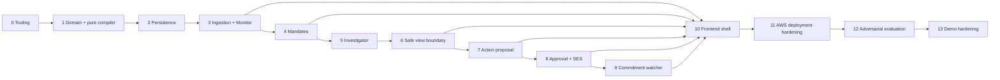

# Build order and dependency gates

## Critical path

The frontend shell may begin after Phase 3 contracts, but no surface is complete until the corresponding backend phase is stable. CDK skeleton starts in Phase 0; production-like deployment hardening remains Phase 11. Work must not bypass gates by creating canned view/action/result fixtures in the application.

## Gate checklist

| Gate | Must be true before continuing |
|---|---|
| 0→1 | clean frozen installs; lint/type/test/synth commands; import boundary test |
| 1→2 | domain/state/compiler invariant suite green; exact hash golden |
| 2→3 | repository contract parity; transactions/idempotency/cross-case isolation green |
| 3→4 | message replay/noise/pattern discovery works through validated agent output |
| 4→5 | immutable approve/adjust/refuse/revoke with identity/content separation |
| 5→6 | deterministic sufficiency/independence and contradiction; no agent state authority |
| 6→7 | compiler sole-writer IAM, zero sentinel leaks, current safe view/hash |
| 7→8 | Action payload capture safe; citation validator/artifact canaries green |
| 8→9 | SES call count 1; stale race prevented; unknown quarantined |
| 9→10 | real schedule plus same watcher demo-clock path; only human resolves |
| 10→11 | exactly three usable accessible surfaces and full local smoke |
| 11→12 | reproducible deploy, service prerequisites, IAM canaries, observability |
| 12→13 | all binary gates zero and quality thresholds passed |
| implementation-ready | all architecture docs/ADRs consistent and explicit approval received |

## Safe parallel work after approval

Parallelism is intentionally limited by contracts:

- after Phase 1, CDK data-resource assertions and in-memory/Dynamo repository adapters can proceed independently against frozen domain keys;
- after Phase 3 API/OpenAPI stabilizes, feed UI can proceed while mandate backend is built;
- after Phase 6, Action runtime and private/shareable UI compare can proceed in parallel;
- after Phase 8, commitment backend and frontend action polish can proceed in parallel;
- evaluation fixtures/tests can be authored alongside each phase but cannot declare pass until the implementation exists.

No parallel work may redefine enums, hashes, persisted keys, IAM boundaries, or endpoint contracts without first resolving the source-of-truth change.

## First vertical security proof

Before optimizing discovery/UI, implement one synthetic fact through: approved mandate → pure compiler → view hash → Action input capture → deliberately invalid proposal rejection. This early proof has no SES and no claim of product completion; it catches unsafe package/data boundaries before expensive integration work.

## Stop conditions

Stop forward progress and repair the current phase if any privacy invariant fails, a foreign ID is skipped, Action artifact contains a private import/permission, a state transition lacks a guard, a side effect lacks a durable idempotency state, or documentation and code disagree on canonical bytes. Schedule/SES/model availability is an operational blocker, not permission to introduce a fake success path.
